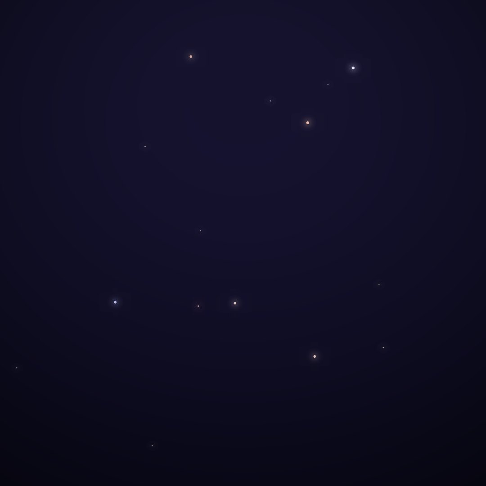
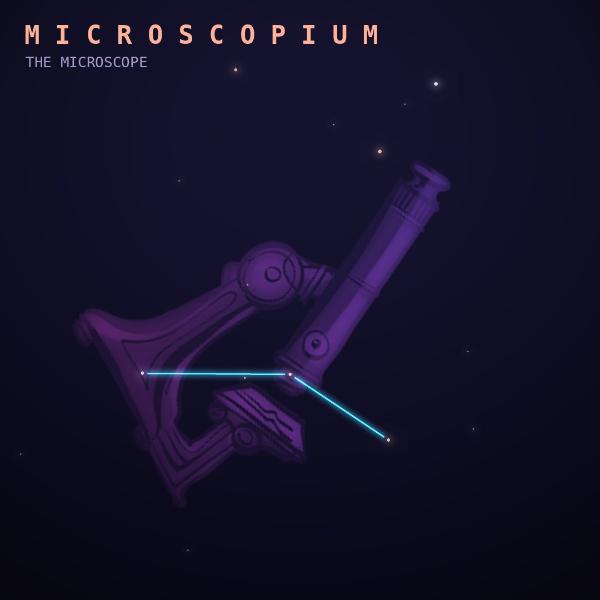

## Front

Which constellation is this?

## Back
# Microscopium
*The Microscope* · Mic · genitive *Microscopii*

One of Lacaille's 1750s instrument constellations, a faint patch south of Capricornus honoring the early compound microscope.

- **Brightest star:** γ Microscopii, magnitude 4.7
- **Best seen:** September evenings
- **Fully visible:** between 45°N and 90°S

> **Fun fact:** AU Microscopii, a young red dwarf 32 light-years away, has an edge-on dust disk and young planets, so astronomers can watch a planetary system in the making.
