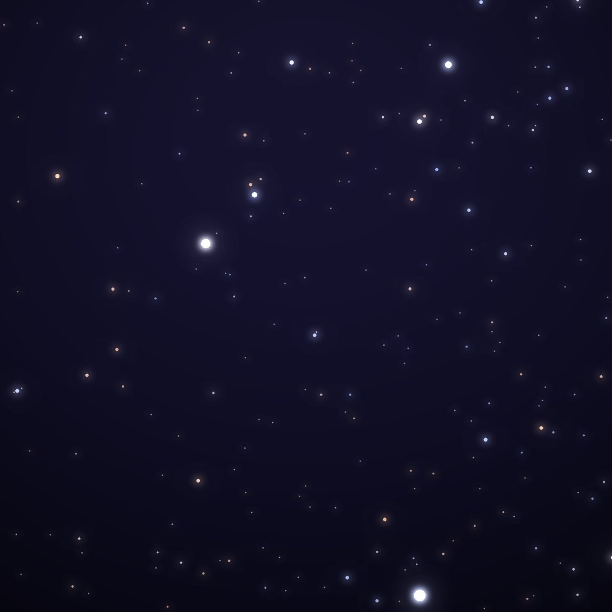
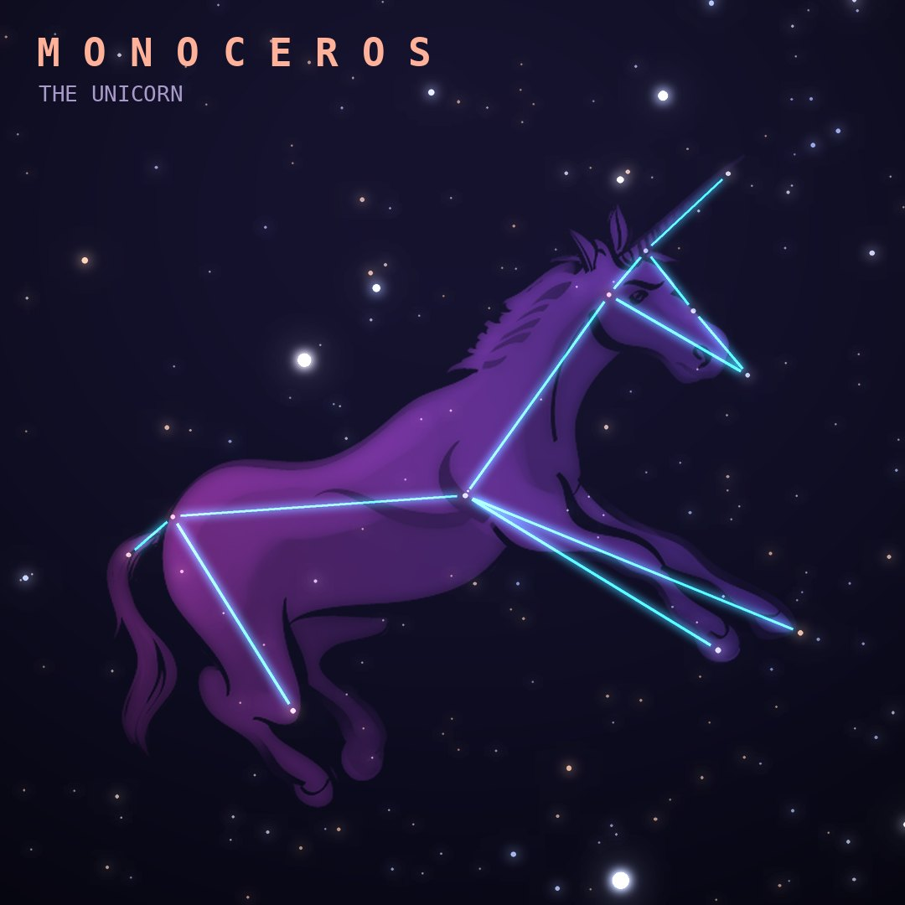

## Front

Which constellation is this?

## Back
# Monoceros
*The Unicorn* · Mon · genitive *Monocerotis*

A faint unicorn introduced by Petrus Plancius in 1612, filling the middle of the Winter Triangle formed by Betelgeuse, Sirius and Procyon.

- **Brightest star:** β Monocerotis, magnitude 3.8
- **Best seen:** February evenings
- **Fully visible:** between 80°N and 80°S

> **Fun fact:** In 2002 the star V838 Monocerotis flared up, and its "light echo" spreading through surrounding dust made one of Hubble's most famous image sequences.
