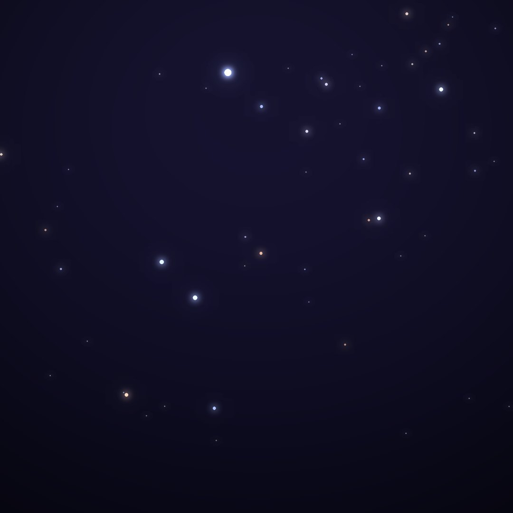
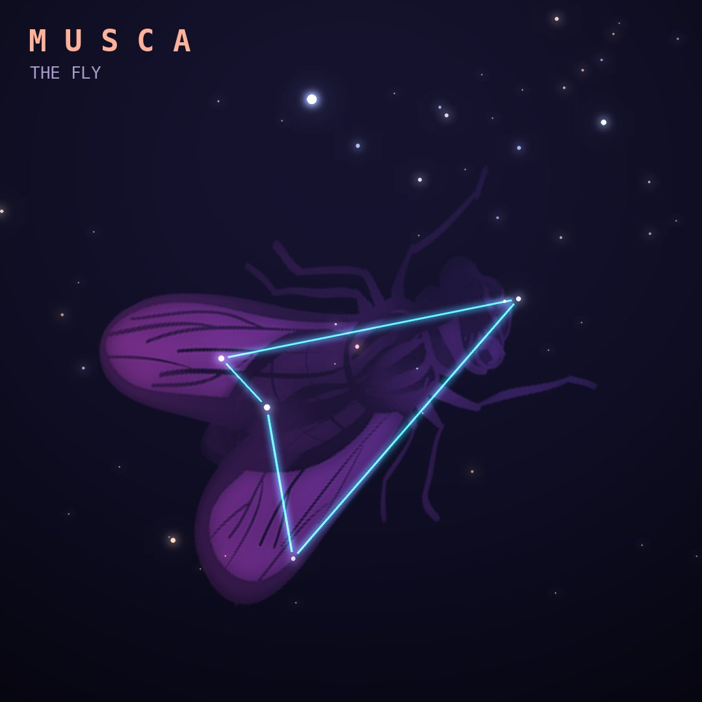

## Front

Which constellation is this?

## Back
# Musca
*The Fly* · Mus · genitive *Muscae*

A small southern constellation just below the Southern Cross, introduced by Keyser and de Houtman in the 1590s.

- **Brightest star:** α Muscae, magnitude 2.7
- **Best seen:** May evenings
- **Fully visible:** between 15°N and 90°S

> **Fun fact:** It is the only insect in today's sky. A northern fly, Musca Borealis, once buzzed near Aries but was dropped from the official list.
