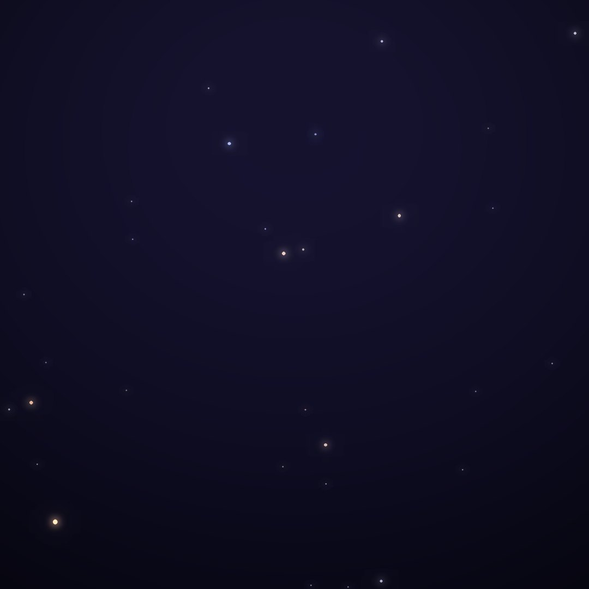
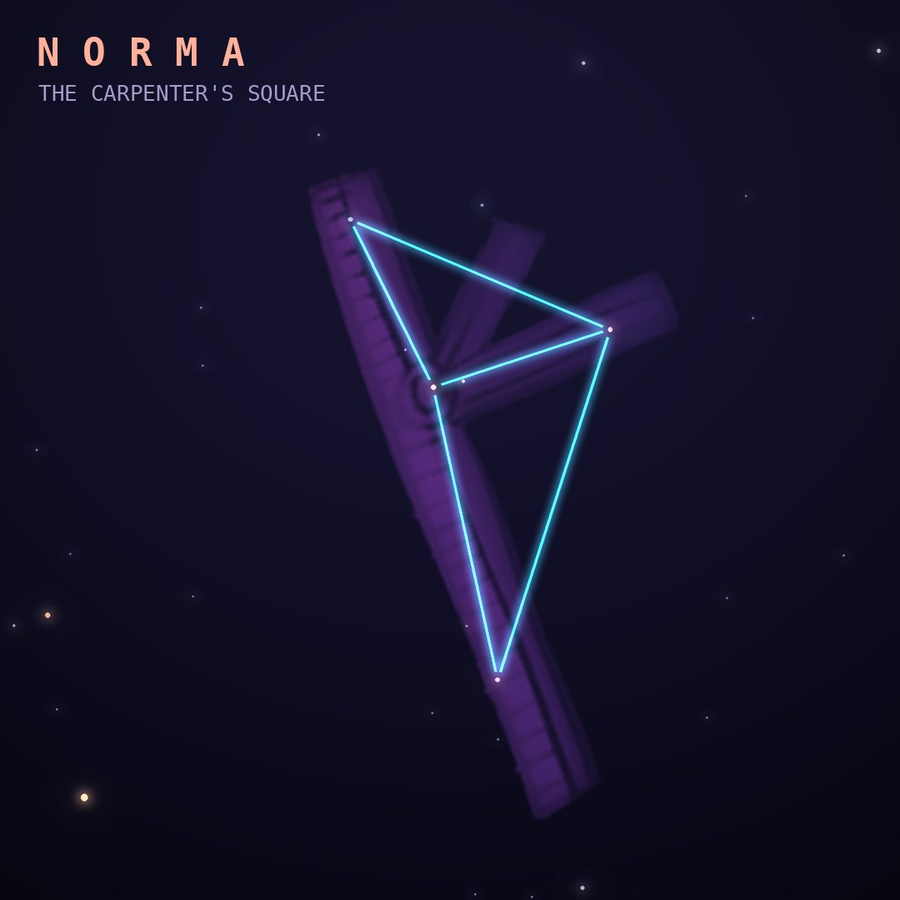

## Front

Which constellation is this?

## Back
# Norma
*The Carpenter's Square* · Nor · genitive *Normae*

One of Lacaille's 1750s instrument constellations, representing a carpenter's set square, lying in the Milky Way between Lupus and Ara.

- **Brightest star:** γ2 Normae, magnitude 4.0
- **Best seen:** July evenings
- **Fully visible:** between 30°N and 90°S

> **Fun fact:** Norma has no Alpha or Beta star: when the IAU redrew constellation borders, its original Alpha and Beta ended up inside Scorpius.
