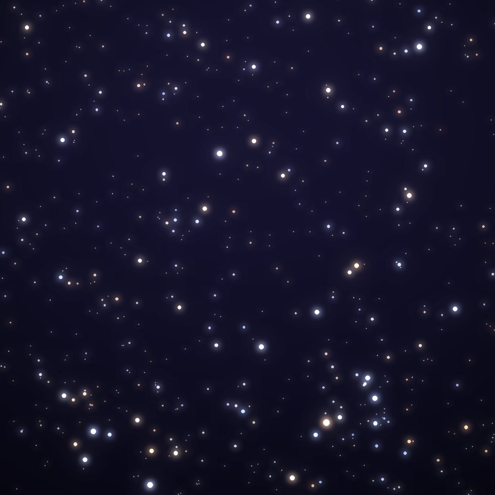
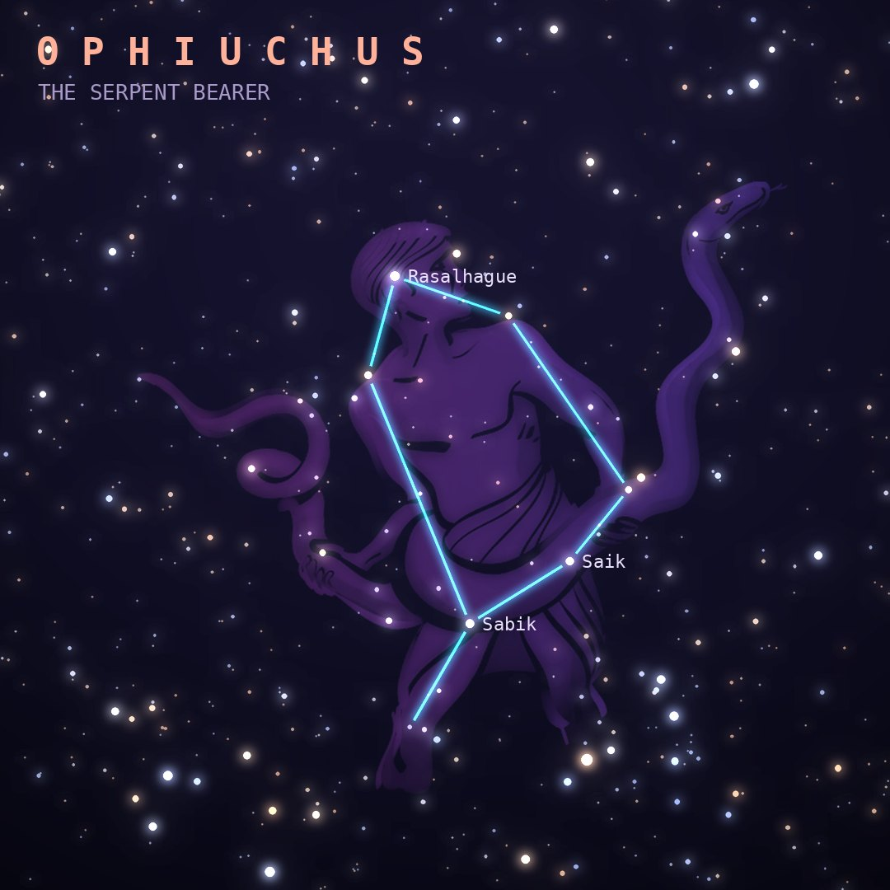

## Front

Which constellation is this?

## Back
# Ophiuchus
*The Serpent Bearer* · Oph · genitive *Ophiuchi*

Asclepius, the healer so skilled he could raise the dead, shown wrestling a great snake that splits Serpens into two halves.

- **Brightest star:** Rasalhague (α Ophiuchi), magnitude 2.1
- **Best seen:** July evenings
- **Fully visible:** between 60°N and 75°S

> **Fun fact:** The Sun passes through Ophiuchus every year in early December, making it the "13th zodiac constellation" astrologers leave out. Kepler's Supernova of 1604, the last naked-eye supernova seen in our galaxy, appeared here.
