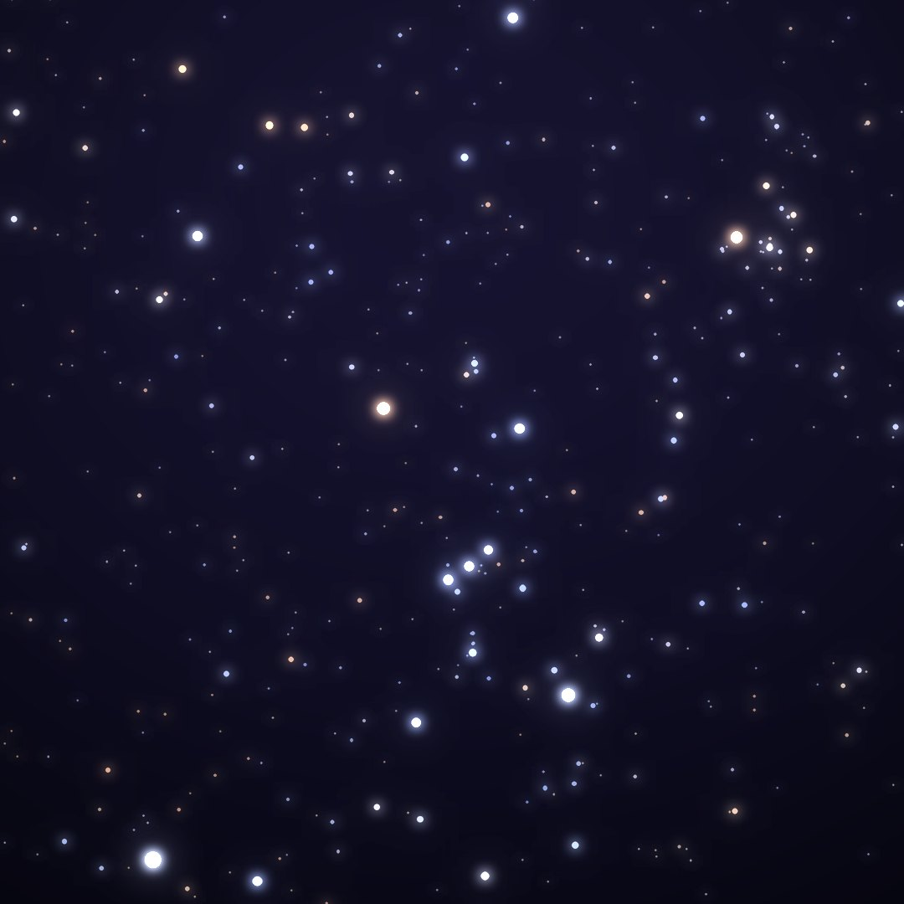
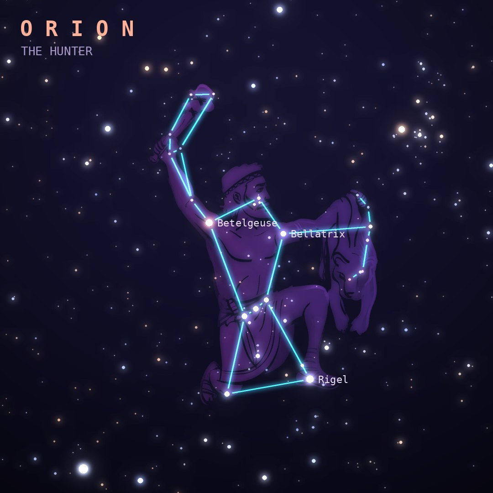

## Front

Which constellation is this?

## Back
# Orion
*The Hunter* · Ori · genitive *Orionis*

The great hunter, with his three-star belt, red Betelgeuse on his shoulder and blue-white Rigel at his foot. He straddles the celestial equator, so he can be seen from every inhabited place on Earth.

- **Brightest star:** Rigel (β Orionis), magnitude 0.2
- **Best seen:** January evenings
- **Fully visible:** between 80°N and 70°S

> **Fun fact:** The fuzzy "star" in Orion's sword is the Orion Nebula, a stellar nursery about 1,300 light-years away. Betelgeuse surprised astronomers by fading dramatically in 2019-2020, the "Great Dimming".
