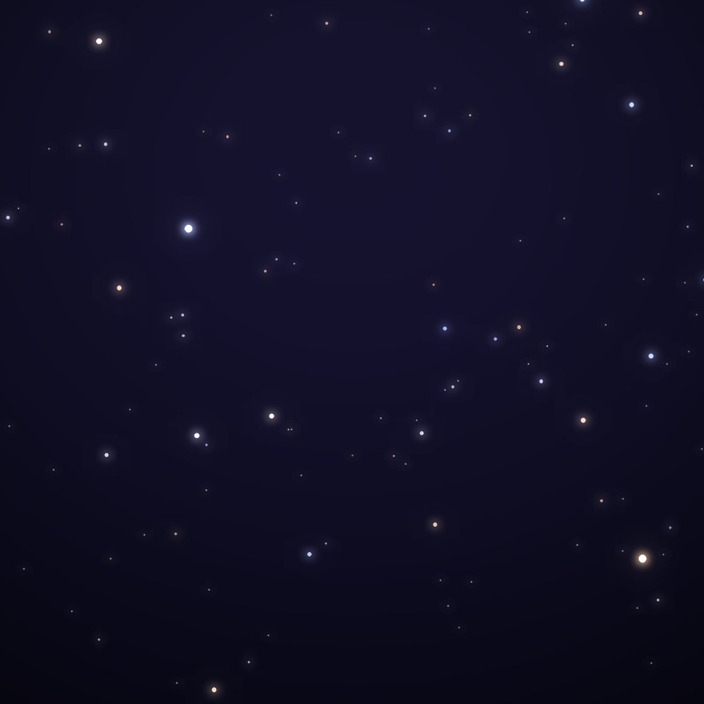
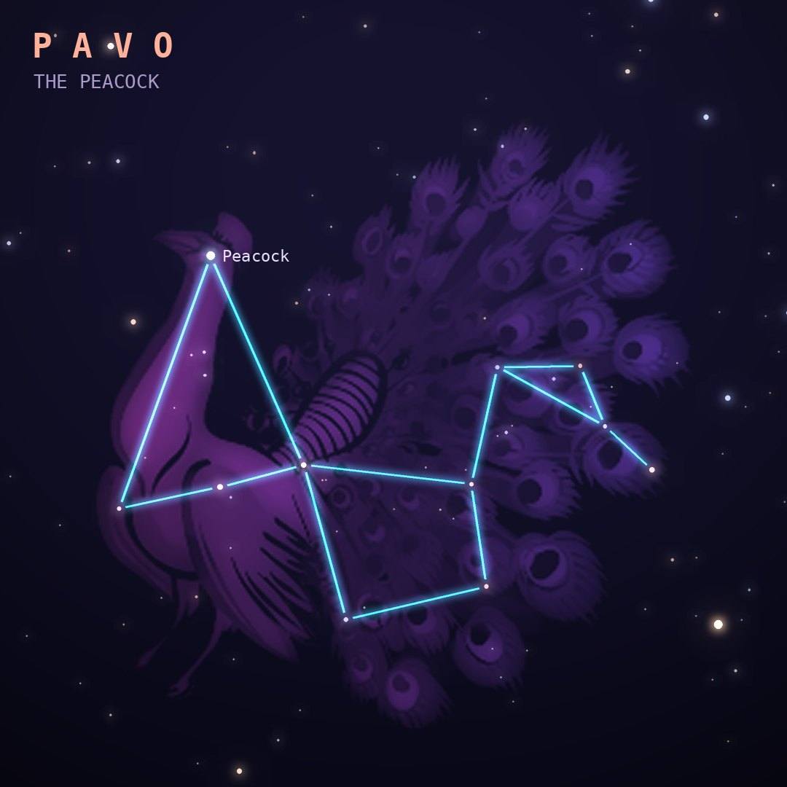

## Front

Which constellation is this?

## Back
# Pavo
*The Peacock* · Pav · genitive *Pavonis*

A peacock, introduced by Keyser and de Houtman in the 1590s. It is often linked to Hera's sacred bird, whose tail held the hundred eyes of Argus.

- **Brightest star:** Peacock (α Pavonis), magnitude 1.9
- **Best seen:** August evenings
- **Fully visible:** between 15°N and 90°S

> **Fun fact:** Its brightest star is officially named "Peacock", a name invented in the 1930s for the Royal Air Force's air navigation almanac.
