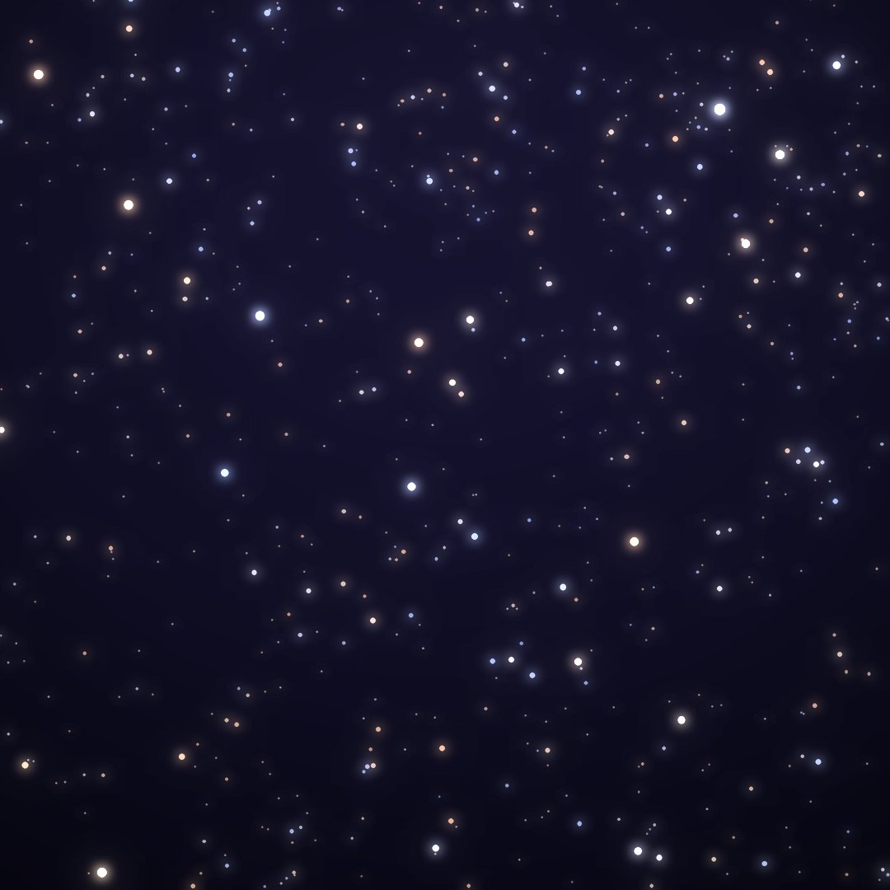
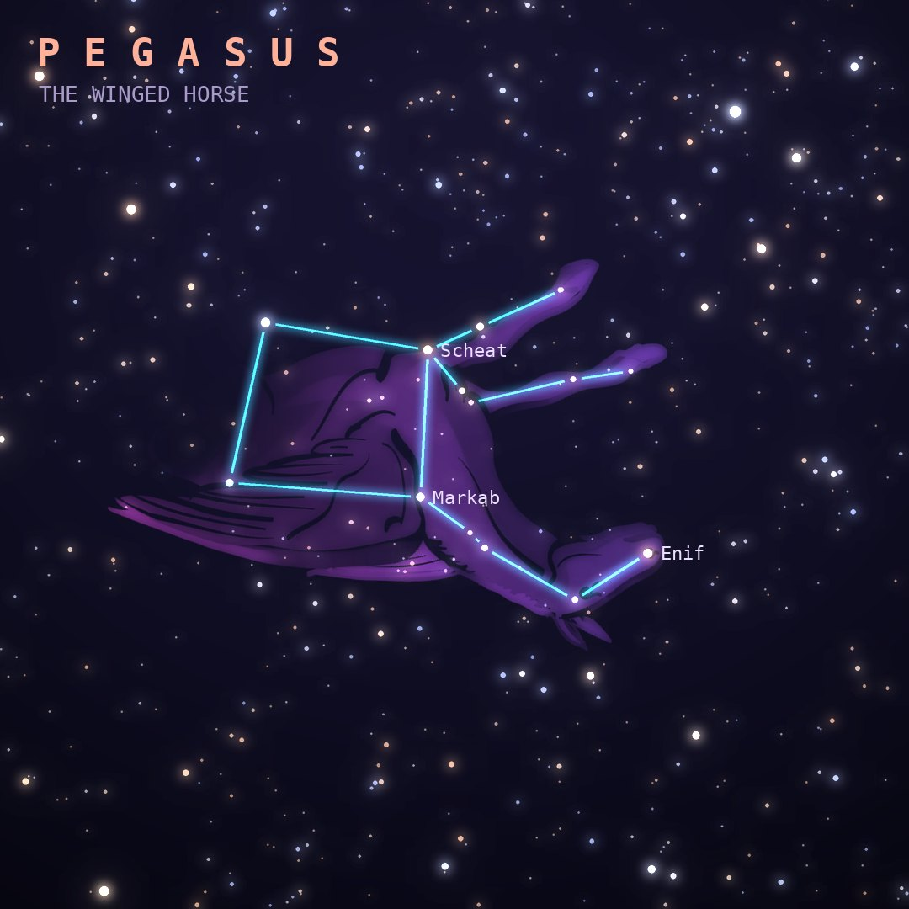

## Front

Which constellation is this?

## Back
# Pegasus
*The Winged Horse* · Peg · genitive *Pegasi*

The winged horse that sprang from Medusa's neck when Perseus beheaded her. Its body is the Great Square of Pegasus, a huge box of four stars in autumn skies.

- **Brightest star:** Enif (ε Pegasi), magnitude 2.4
- **Best seen:** October evenings
- **Fully visible:** between 90°N and 55°S

> **Fun fact:** 51 Pegasi b, found in 1995, was the first planet discovered orbiting a Sun-like star, a discovery that won Michel Mayor and Didier Queloz the 2019 Nobel Prize in Physics.
