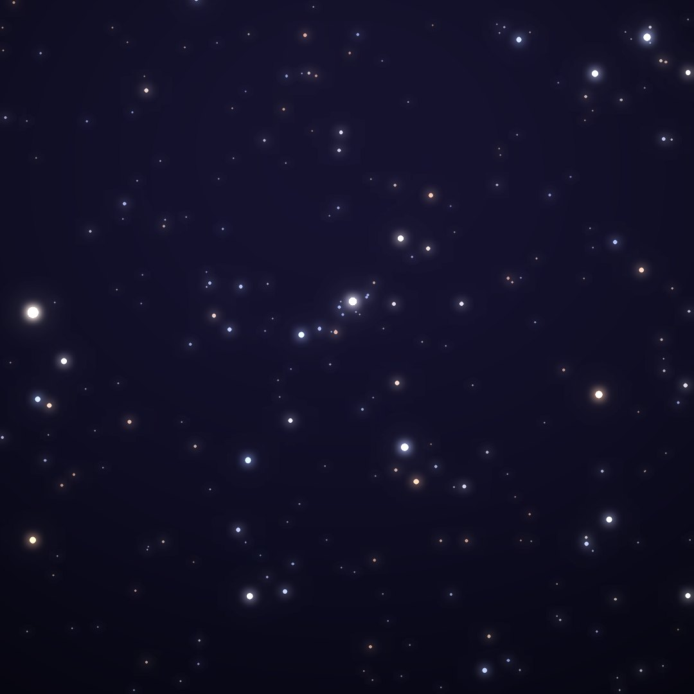
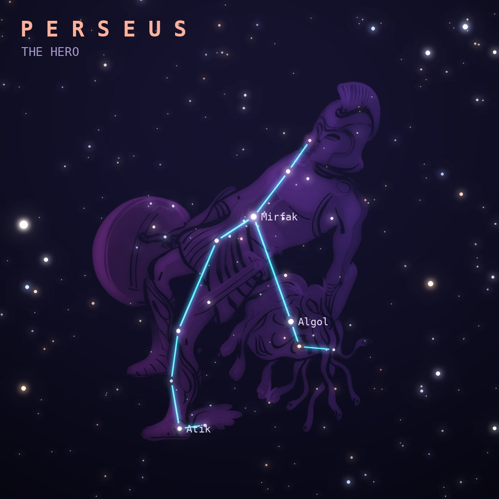

## Front

Which constellation is this?

## Back
# Perseus
*The Hero* · Per · genitive *Persei*

The hero who beheaded Medusa and rescued Andromeda from the sea monster. He holds Medusa's head, marked by the star Algol.

- **Brightest star:** Mirfak (α Persei), magnitude 1.8
- **Best seen:** December evenings
- **Fully visible:** between 90°N and 30°S

> **Fun fact:** Algol, the "Demon Star", visibly dims every 2.87 days when a companion star passes in front of it. Each August the Perseid meteor shower radiates from this constellation.
