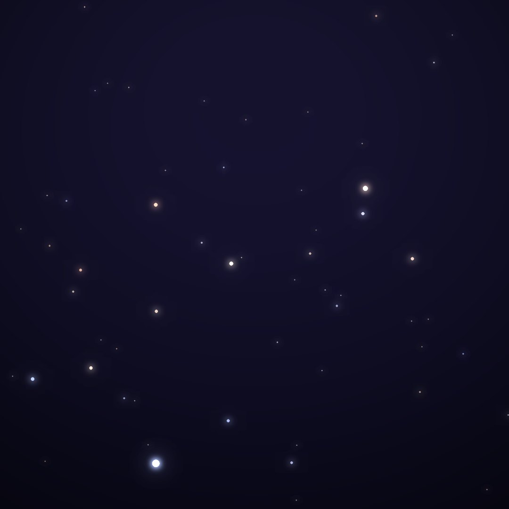
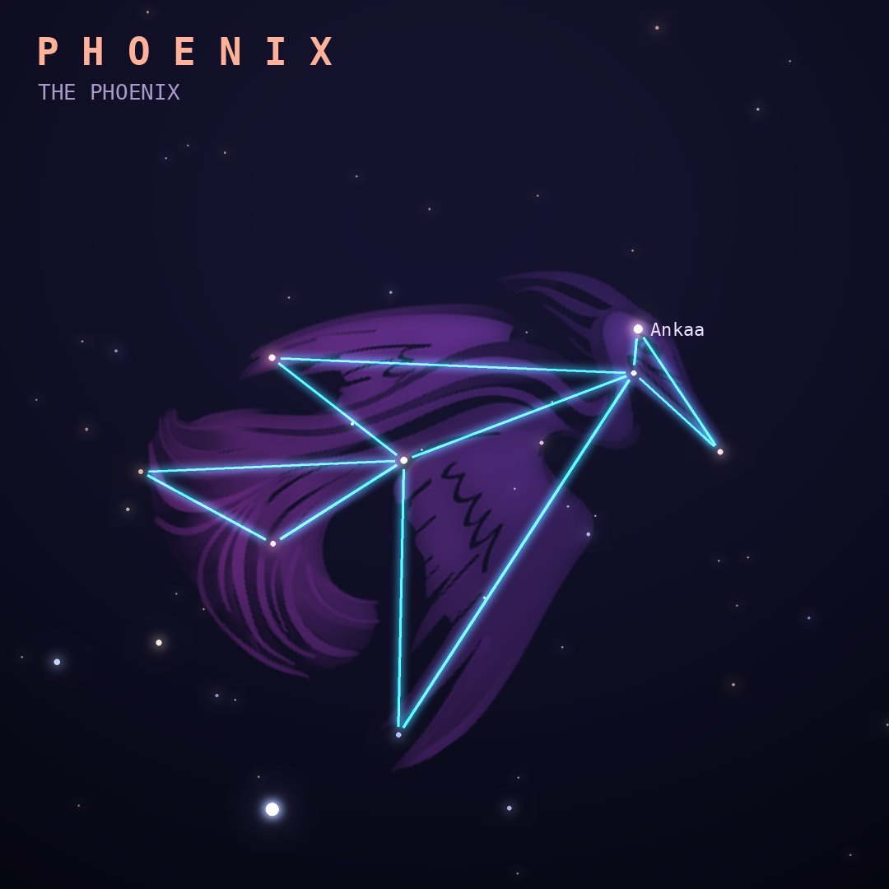

## Front

Which constellation is this?

## Back
# Phoenix
*The Phoenix* · Phe · genitive *Phoenicis*

The mythical bird reborn from its own ashes, introduced by Keyser and de Houtman in the 1590s. It lies near Achernar in the southern sky.

- **Brightest star:** Ankaa (α Phoenicis), magnitude 2.4
- **Best seen:** November evenings
- **Fully visible:** between 35°N and 90°S

> **Fun fact:** The Phoenix Cluster, a galaxy cluster billions of light-years beyond it, has a central galaxy forming new stars at hundreds of times the Milky Way's rate.
