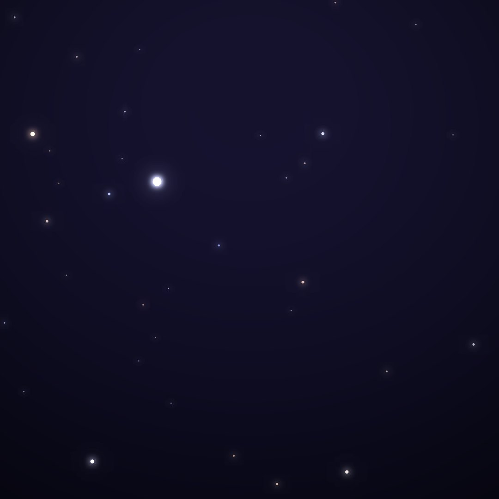
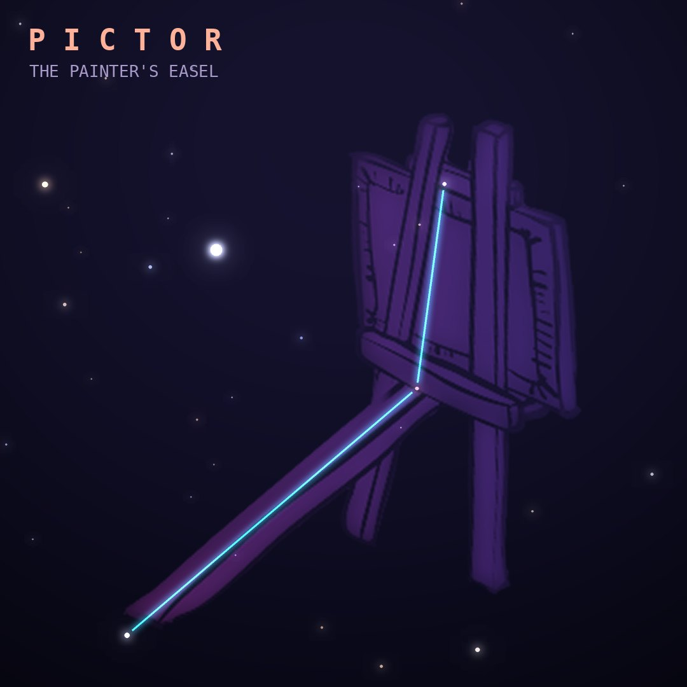

## Front

Which constellation is this?

## Back
# Pictor
*The Painter's Easel* · Pic · genitive *Pictoris*

One of Lacaille's 1750s inventions, originally "le Chevalet et la Palette", the painter's easel and palette. It lies near the brilliant star Canopus.

- **Brightest star:** α Pictoris, magnitude 3.2
- **Best seen:** February evenings
- **Fully visible:** between 30°N and 90°S

> **Fun fact:** Beta Pictoris was one of the first stars found with a disk of planet-forming dust (in 1984), and at least two giant planets have since been photographed around it.
