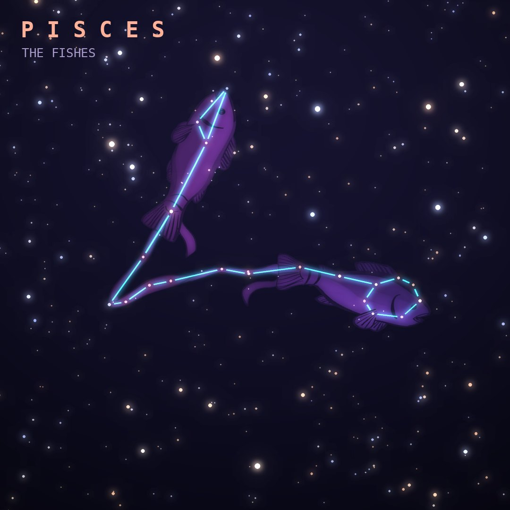

## Front

Which constellation is this?

## Back
# Pisces
*The Fishes* · Psc · genitive *Piscium*

Two fish tied together by a cord: Aphrodite and Eros, who turned into fish and leapt into a river to escape the monster Typhon. It is a large but faint zodiac constellation.

- **Brightest star:** Alpherg (η Piscium), magnitude 3.6
- **Best seen:** November evenings
- **Fully visible:** between 85°N and 60°S

> **Fun fact:** The March equinox point now lies in Pisces and is slowly drifting toward Aquarius, where it will arrive in about six centuries: the astronomical "Age of Aquarius".
