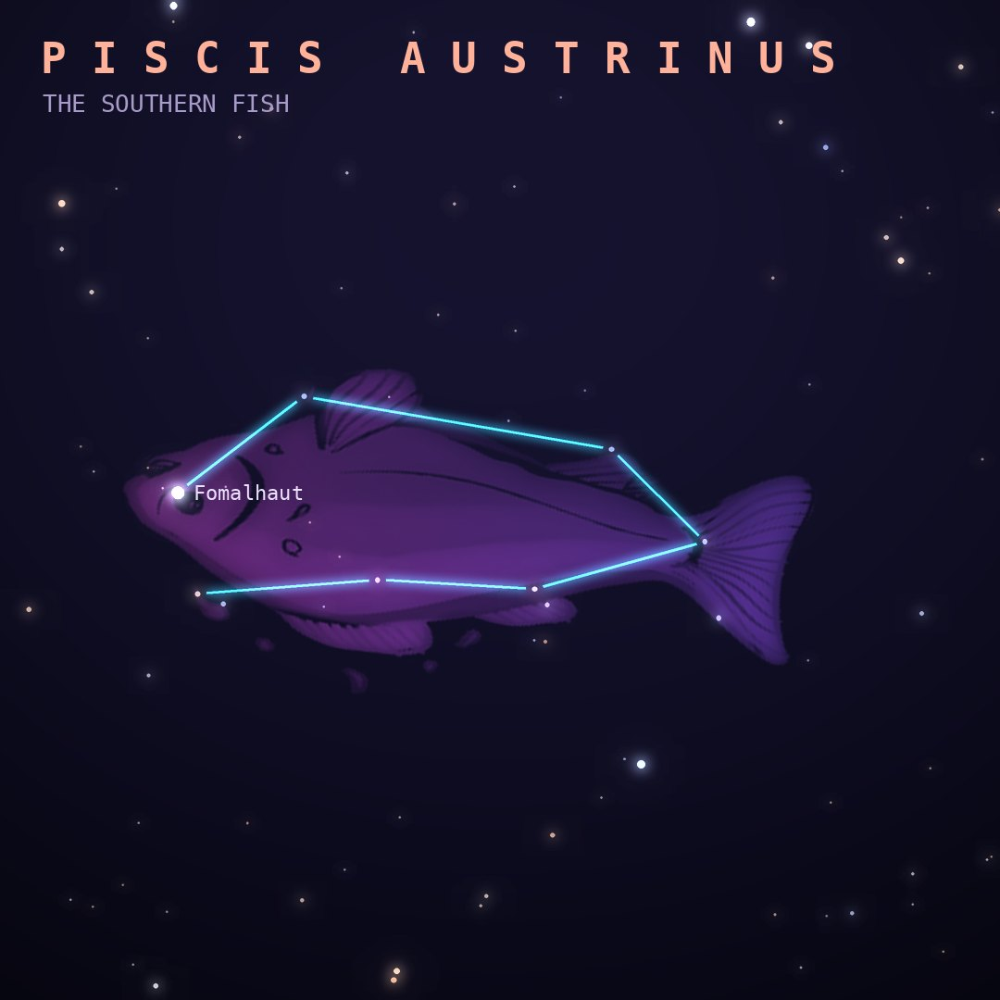

## Front

Which constellation is this?

## Back
# Piscis Austrinus
*The Southern Fish* · PsA · genitive *Piscis Austrini*

A fish drinking the stream of water poured by Aquarius. Its bright star Fomalhaut sits alone in a dim autumn sky.

- **Brightest star:** Fomalhaut (α Piscis Austrini), magnitude 1.2
- **Best seen:** October evenings
- **Fully visible:** between 55°N and 90°S

> **Fun fact:** Fomalhaut has a vast dusty ring. "Fomalhaut b", once celebrated as a directly photographed planet, now seems to have been an expanding cloud of debris from a collision.
