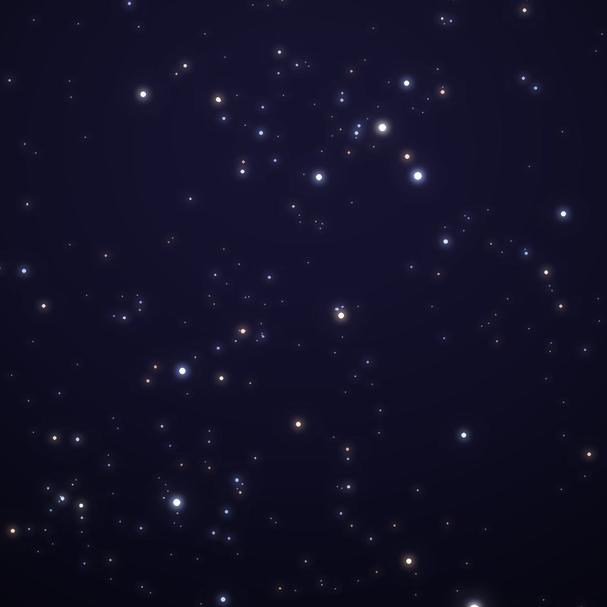
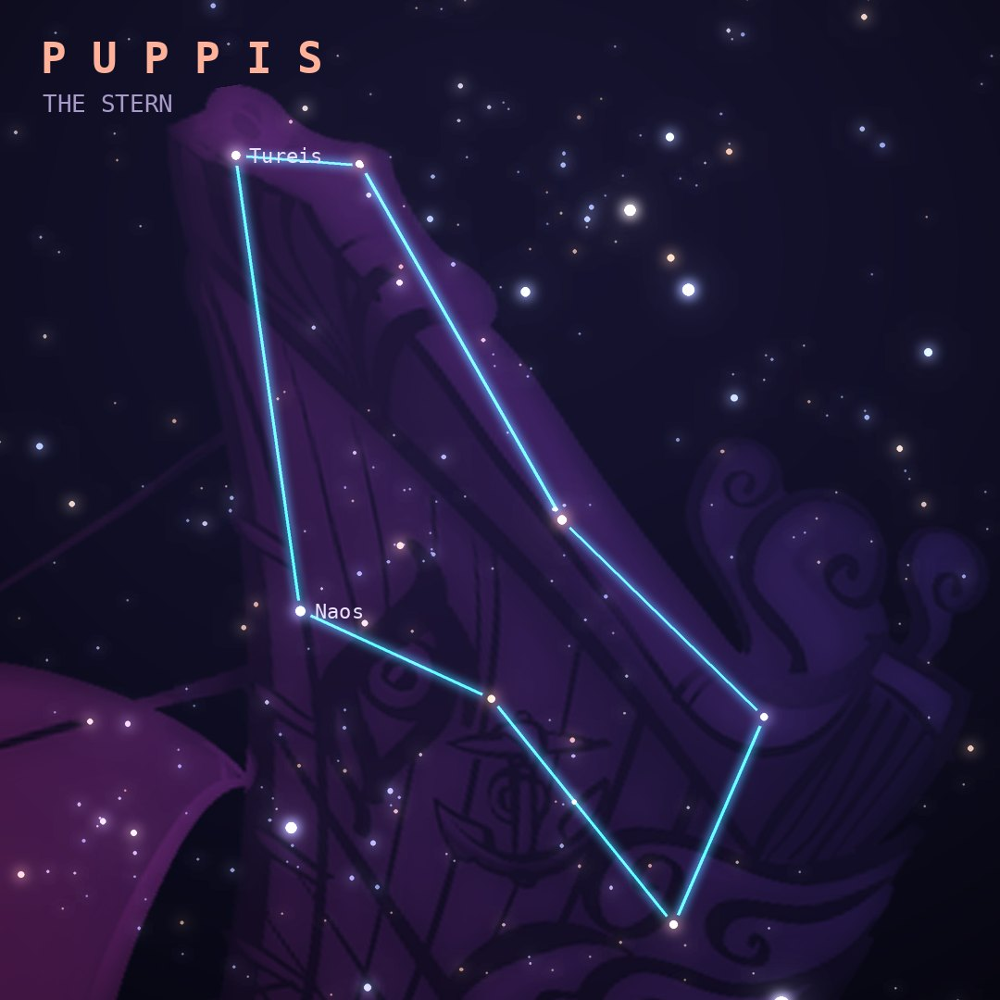

## Front

Which constellation is this?

## Back
# Puppis
*The Stern* · Pup · genitive *Puppis*

The stern, or poop deck, of Jason's ship Argo Navis, which Lacaille split into Carina, Puppis and Vela. The Milky Way runs through it, rich with star clusters.

- **Brightest star:** Naos (ζ Puppis), magnitude 2.2
- **Best seen:** February evenings
- **Fully visible:** between 40°N and 90°S

> **Fun fact:** Because the ship was split up, Puppis has no Alpha or Beta star. Its brightest is Zeta Puppis (Naos), one of the hottest and most luminous stars visible to the naked eye.
