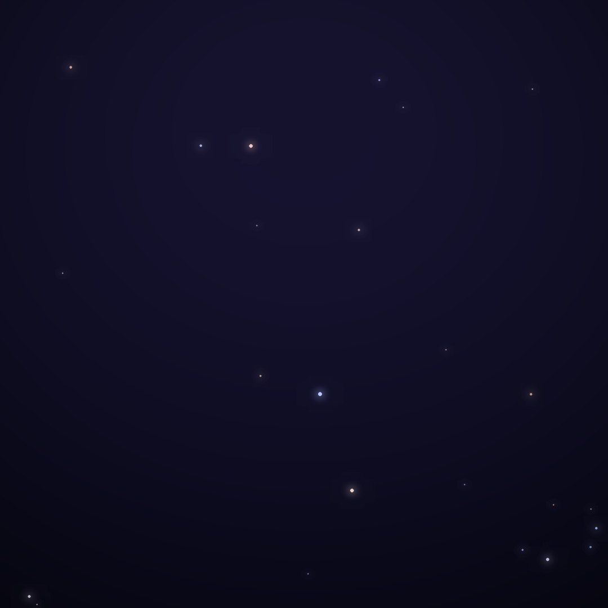

## Front

Which constellation is this?

## Back
# Pyxis
*The Mariner's Compass* · Pyx · genitive *Pyxidis*

One of Lacaille's 1750s inventions, a ship's magnetic compass placed beside the old ship Argo Navis.

- **Brightest star:** α Pyxidis, magnitude 3.7
- **Best seen:** March evenings
- **Fully visible:** between 55°N and 90°S

> **Fun fact:** T Pyxidis is a recurrent nova that has erupted several times since 1890, most recently in 2011.
