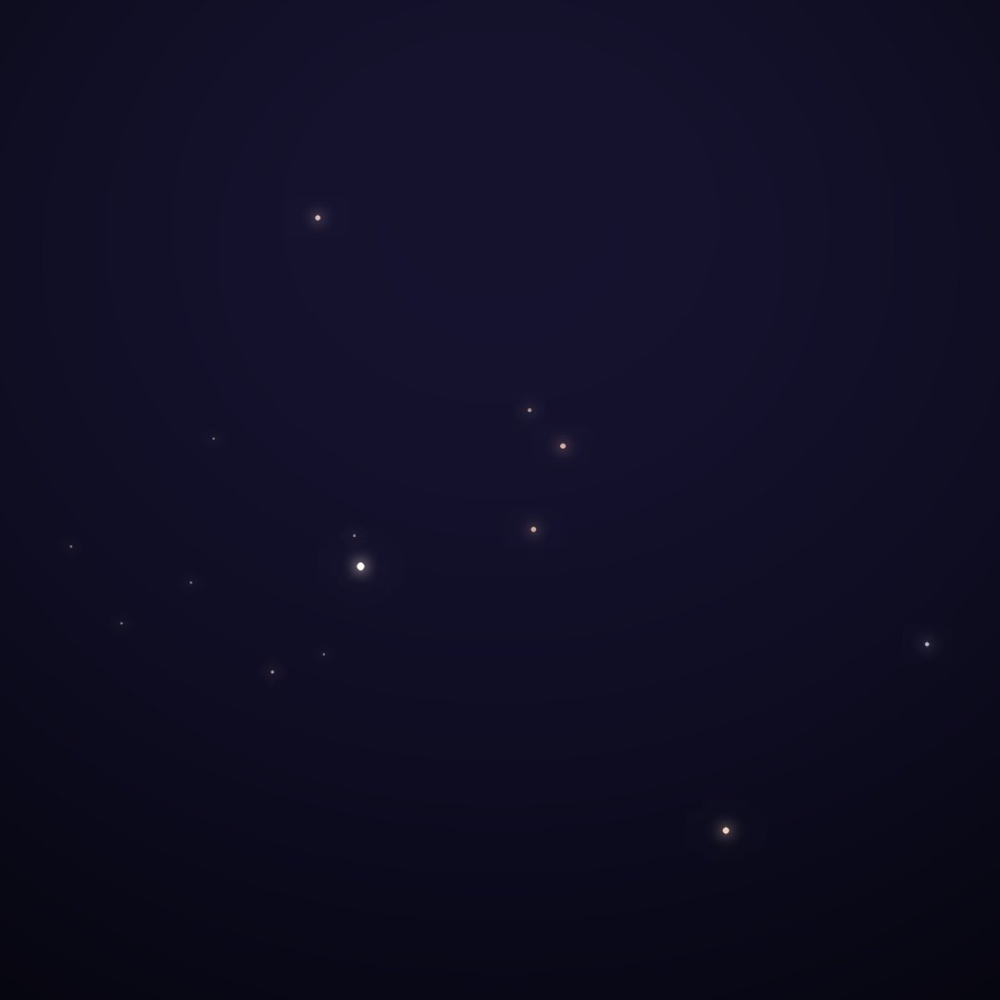
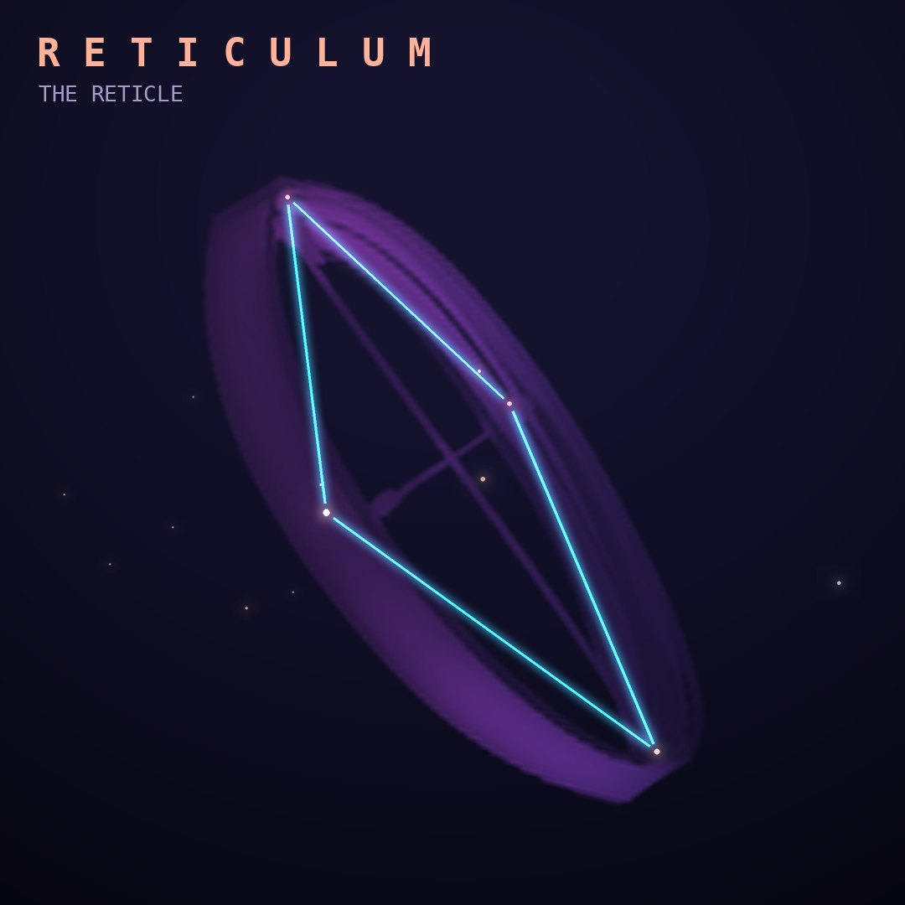

## Front

Which constellation is this?

## Back
# Reticulum
*The Reticle* · Ret · genitive *Reticuli*

Lacaille's tribute to the reticle, the grid of fine crosshairs in a telescope eyepiece that he used to measure star positions.

- **Brightest star:** α Reticuli, magnitude 3.3
- **Best seen:** January evenings
- **Fully visible:** between 25°N and 90°S

> **Fun fact:** Zeta Reticuli, a pair of Sun-like stars 39 light-years away, became famous in UFO lore through the 1961 Betty and Barney Hill abduction story.
