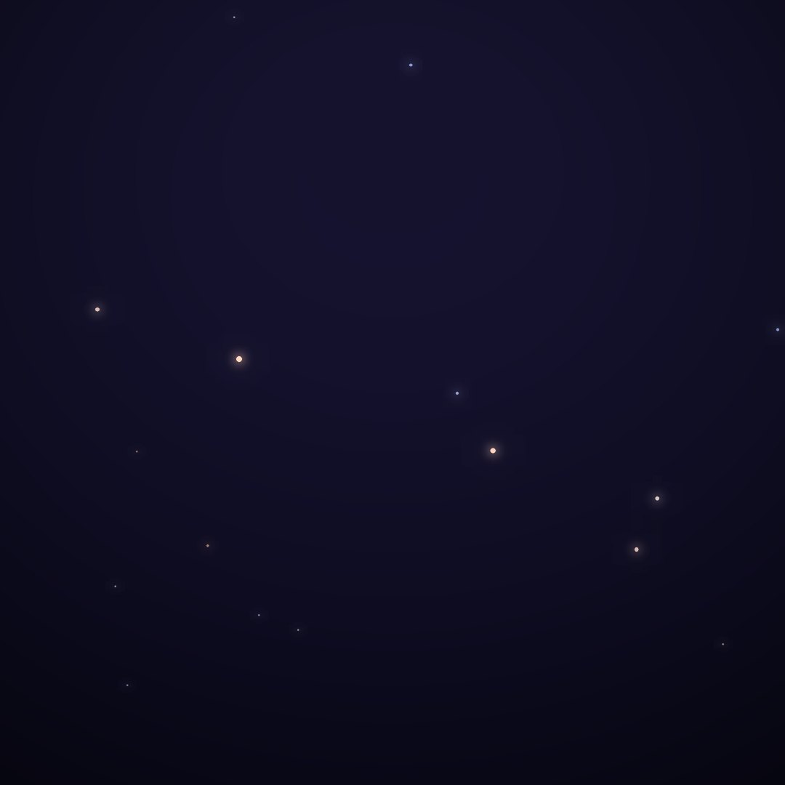
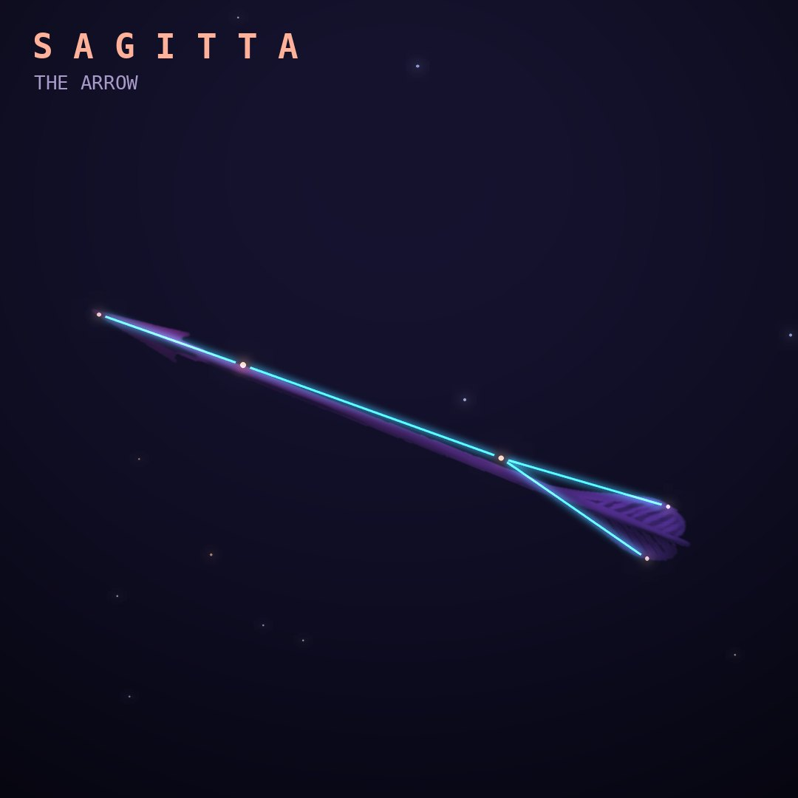

## Front

Which constellation is this?

## Back
# Sagitta
*The Arrow* · Sge · genitive *Sagittae*

An arrow, perhaps the one Heracles shot at the eagle tormenting Prometheus. It is a small, distinct arrow shape between Aquila and Cygnus.

- **Brightest star:** γ Sagittae, magnitude 3.5
- **Best seen:** September evenings
- **Fully visible:** between 90°N and 70°S

> **Fun fact:** Sagitta is the third-smallest constellation, yet it is one of Ptolemy's original 48, because its sharp arrow shape is easy to spot even in the Milky Way.
