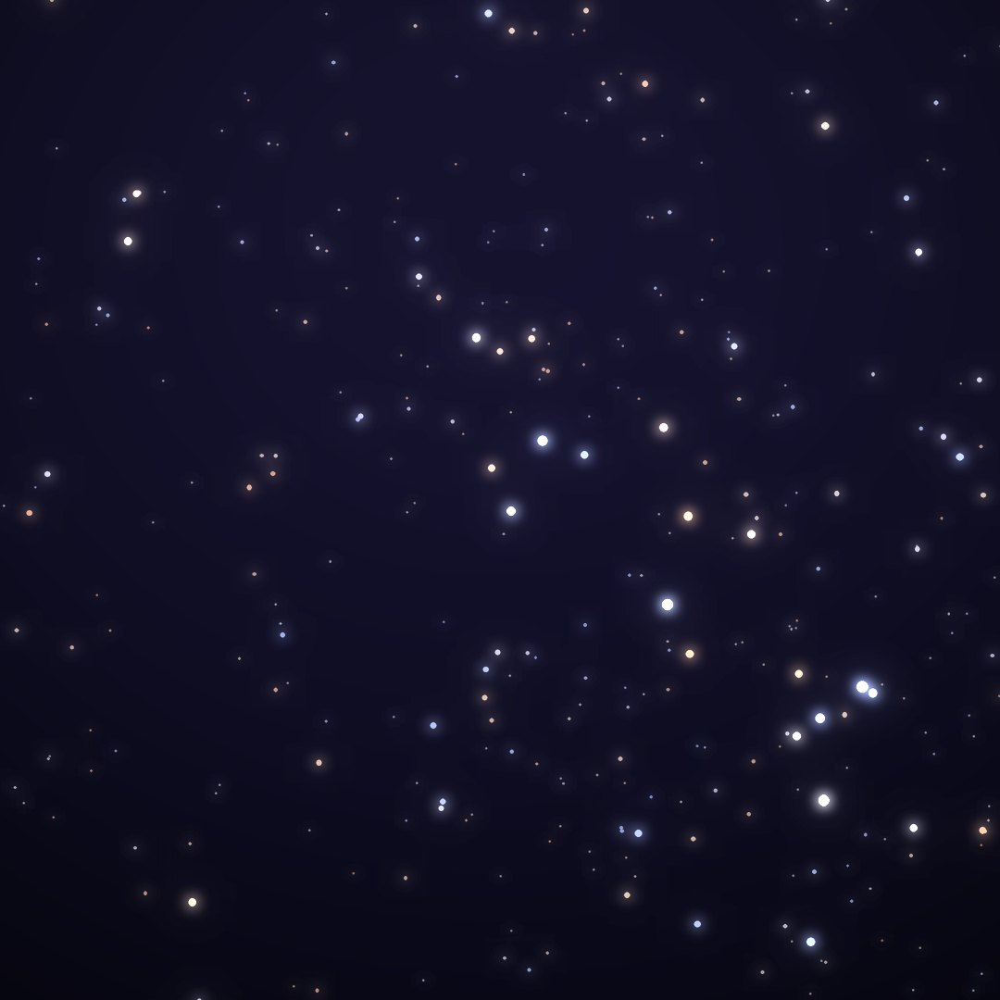
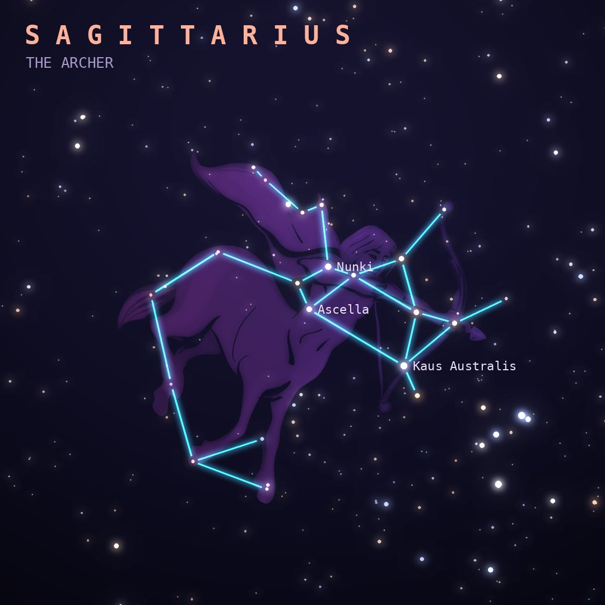

## Front

Which constellation is this?

## Back
# Sagittarius
*The Archer* · Sgr · genitive *Sagittarii*

A centaur archer aiming at the heart of Scorpius, marked by Antares. Its brightest stars form a Teapot, with the Milky Way rising like steam from the spout.

- **Brightest star:** Kaus Australis (ε Sagittarii), magnitude 1.8
- **Best seen:** August evenings
- **Fully visible:** between 45°N and 90°S

> **Fun fact:** The center of the Milky Way lies in Sagittarius, home of Sagittarius A*, a black hole of 4 million Suns that the Event Horizon Telescope photographed in 2022.
