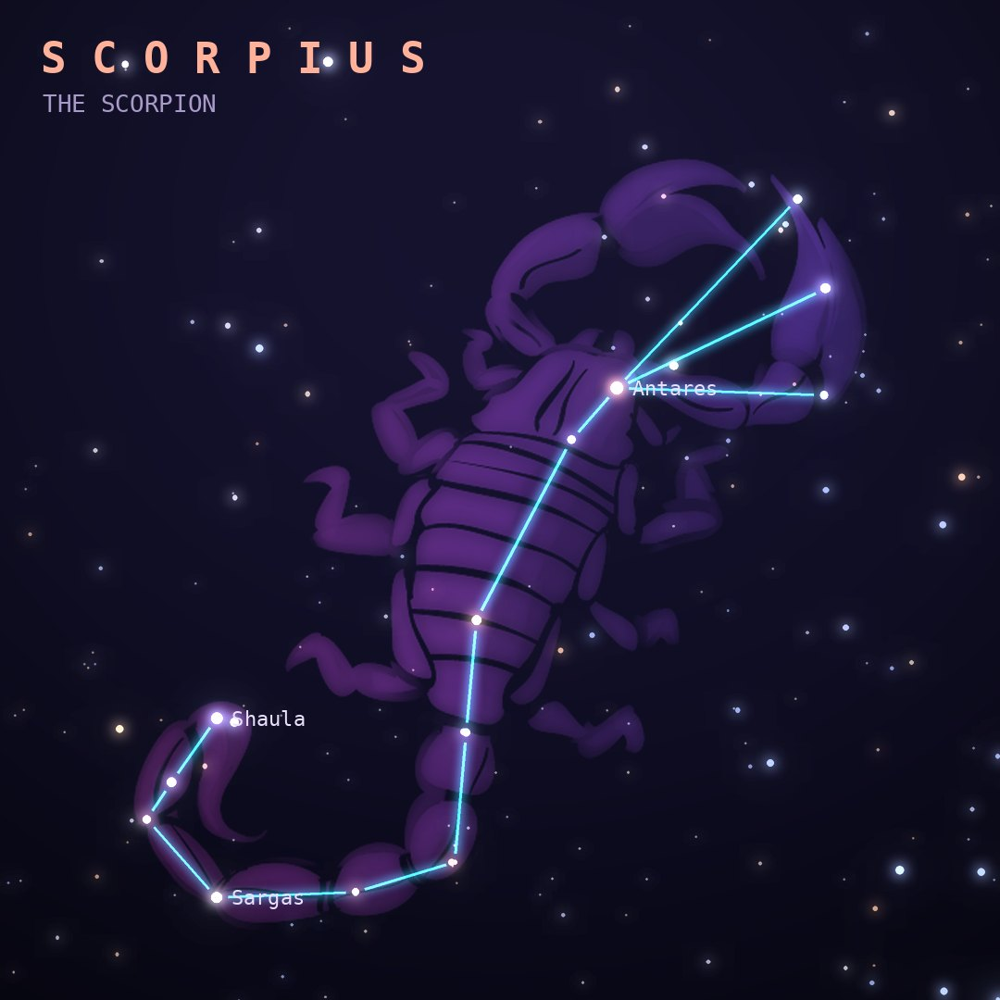

## Front

Which constellation is this?

## Back
# Scorpius
*The Scorpion* · Sco · genitive *Scorpii*

The scorpion that killed Orion. The two were placed on opposite sides of the sky, so one sets as the other rises. Red Antares marks its heart.

- **Brightest star:** Antares (α Scorpii), magnitude 1.1
- **Best seen:** July evenings
- **Fully visible:** between 45°N and 90°S

> **Fun fact:** Antares means "rival of Mars" because its red color matches the planet's. It is a red supergiant roughly 700 times wider than the Sun.
