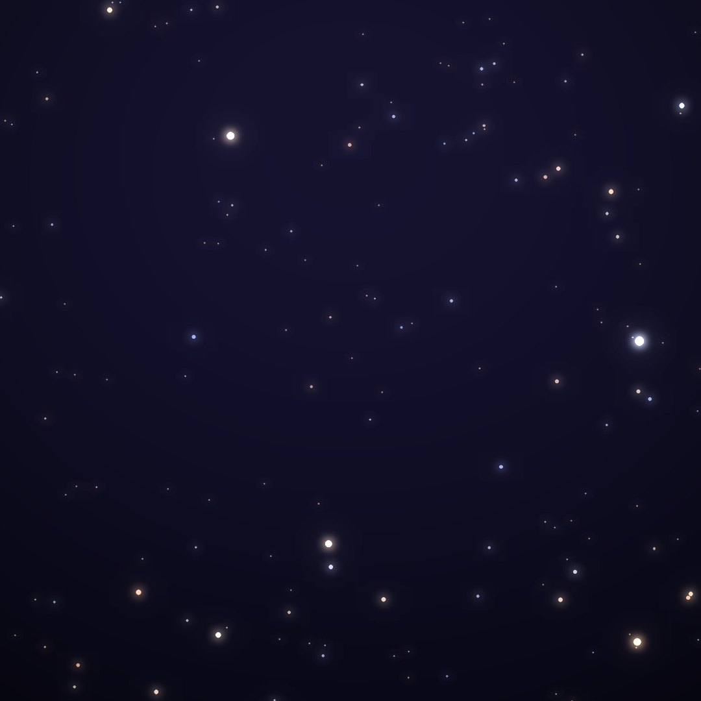
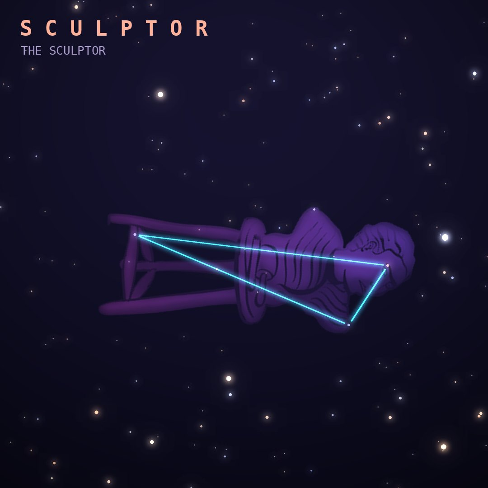

## Front

Which constellation is this?

## Back
# Sculptor
*The Sculptor* · Scl · genitive *Sculptoris*

One of Lacaille's 1750s inventions, originally "l'Atelier du Sculpteur", the sculptor's studio. It is a faint region south of Cetus.

- **Brightest star:** α Sculptoris, magnitude 4.3
- **Best seen:** November evenings
- **Fully visible:** between 50°N and 90°S

> **Fun fact:** The south galactic pole lies in Sculptor, so we look straight out of the Milky Way's disk here, toward the bright Sculptor Galaxy (NGC 253) and many more.
