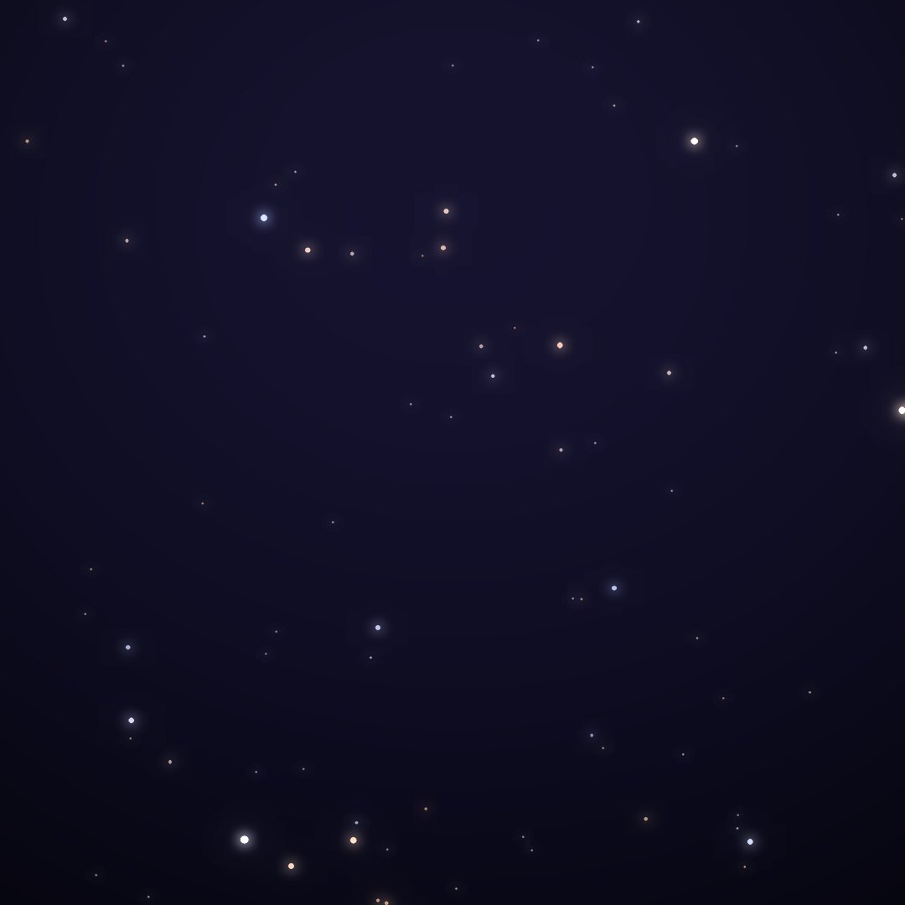
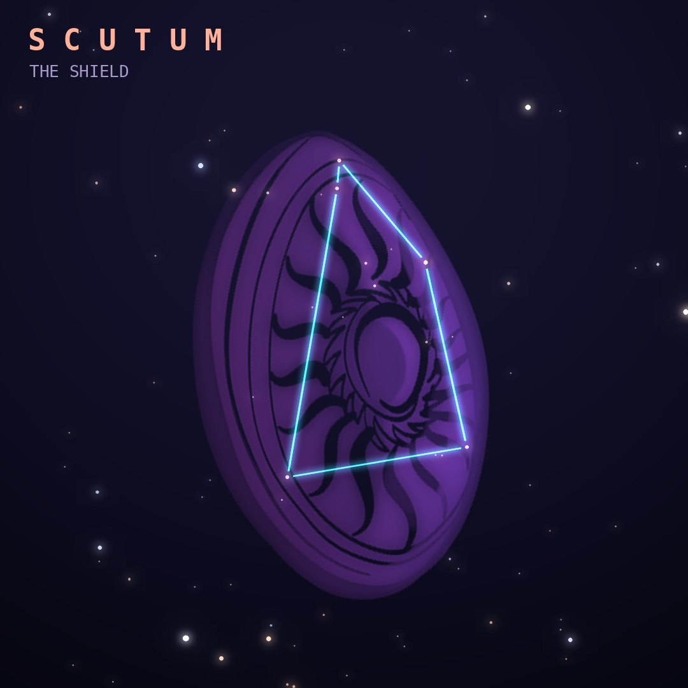

## Front

Which constellation is this?

## Back
# Scutum
*The Shield* · Sct · genitive *Scuti*

Created by Johannes Hevelius in 1684 as Scutum Sobiescianum, Sobieski's shield, honoring King John III Sobieski's victory at the Battle of Vienna.

- **Brightest star:** α Scuti, magnitude 3.9
- **Best seen:** August evenings
- **Fully visible:** between 75°N and 90°S

> **Fun fact:** Scutum and Coma Berenices are the only constellations that honor real people. Scutum contains the Wild Duck Cluster (M11) and UY Scuti, one of the largest stars known.
