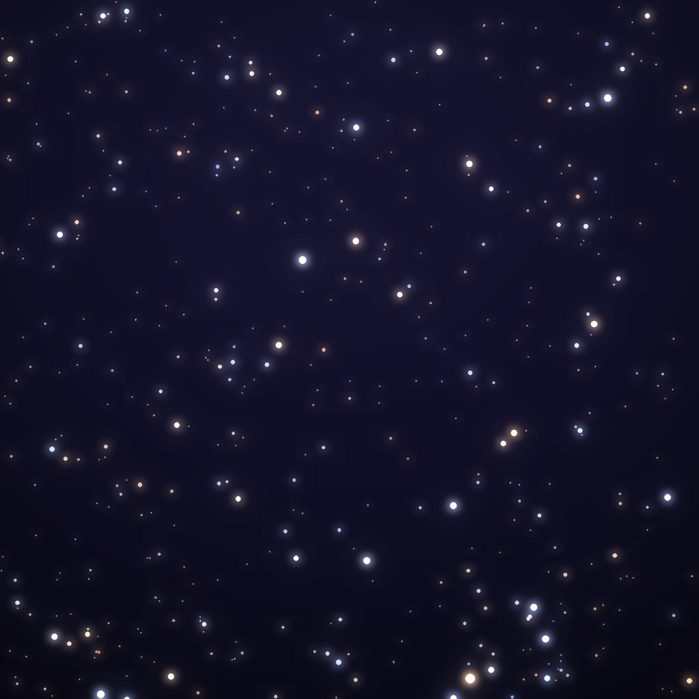
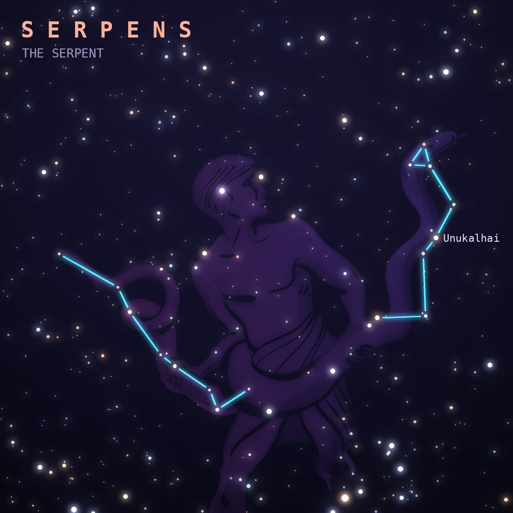

## Front

Which constellation is this?

## Back
# Serpens
*The Serpent* · Ser · genitive *Serpentis*

The great snake held by Ophiuchus, and the only constellation split into two separate pieces: Serpens Caput (the head) and Serpens Cauda (the tail), on either side of the serpent bearer.

- **Brightest star:** Unukalhai (α Serpentis), magnitude 2.6
- **Best seen:** July evenings
- **Fully visible:** between 75°N and 65°S

> **Fun fact:** The Eagle Nebula in Serpens Cauda contains the "Pillars of Creation", towers of gas and dust photographed by Hubble in 1995 and again by JWST in 2022.
