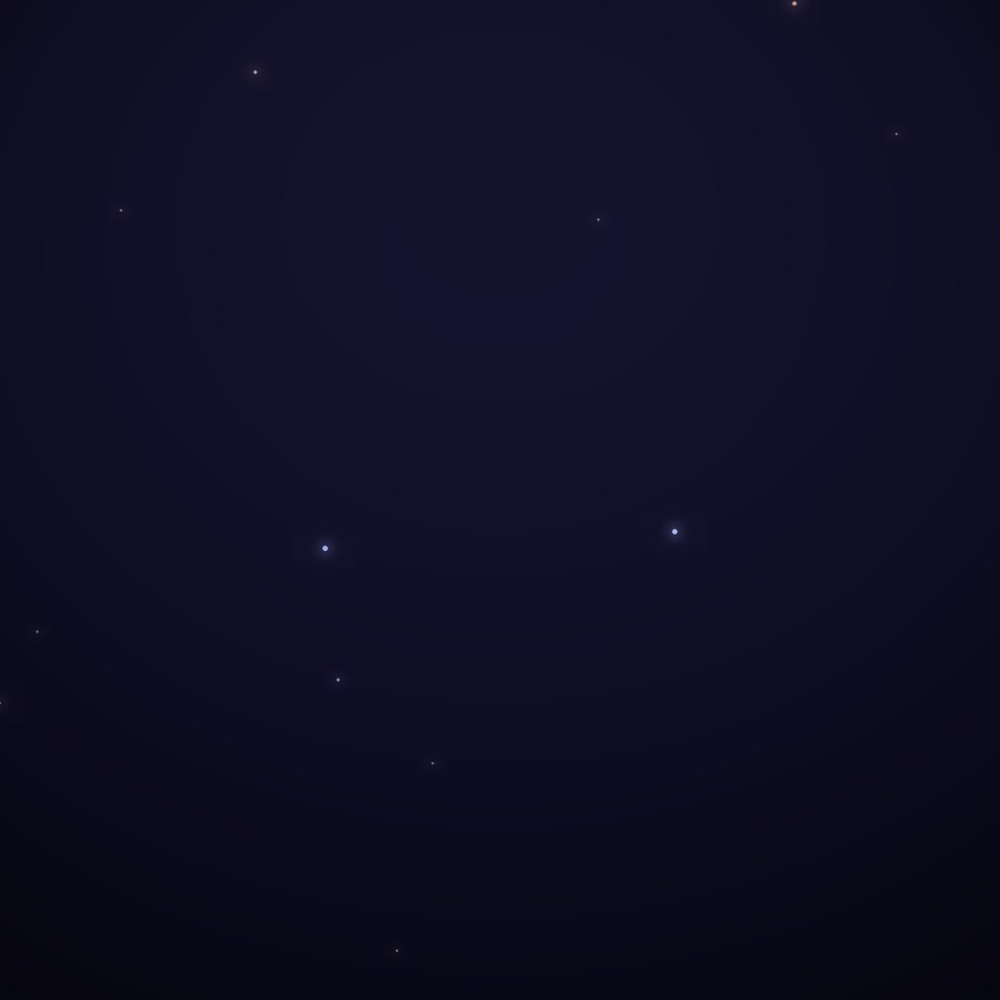
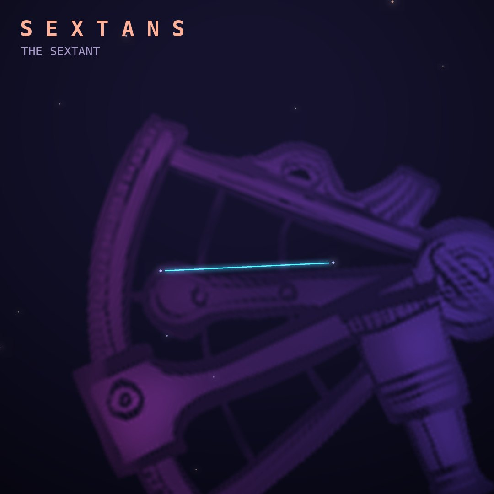

## Front

Which constellation is this?

## Back
# Sextans
*The Sextant* · Sex · genitive *Sextantis*

A faint constellation south of Regulus, created by Johannes Hevelius in 1687 and named after the astronomical sextant he used to measure star positions.

- **Brightest star:** α Sextantis, magnitude 4.5
- **Best seen:** April evenings
- **Fully visible:** between 80°N and 85°S

> **Fun fact:** Hevelius created Sextans in memory of the instruments he lost when a fire destroyed his observatory in Danzig in 1679.
