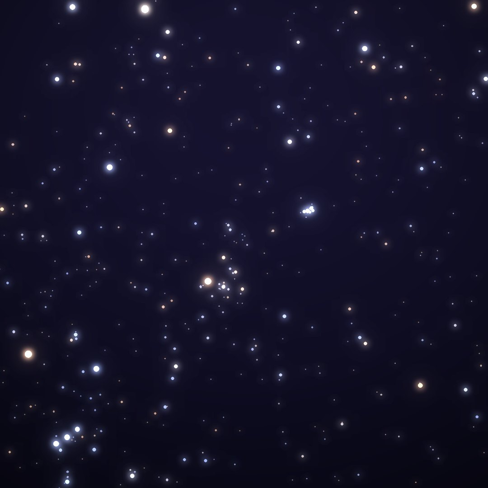
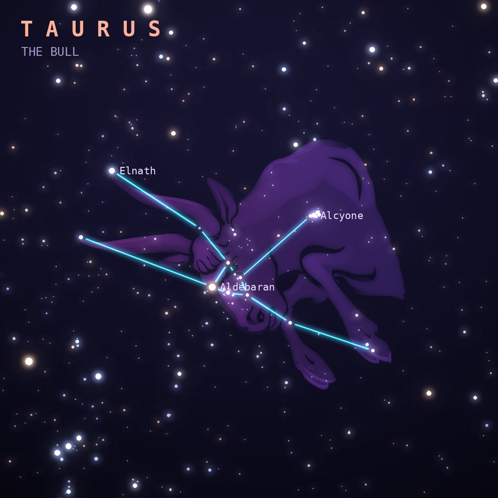

## Front

Which constellation is this?

## Back
# Taurus
*The Bull* · Tau · genitive *Tauri*

Zeus disguised as a white bull to carry off Europa. Red Aldebaran is the bull's eye, the V-shaped Hyades cluster its face, and the Pleiades ride on its shoulder.

- **Brightest star:** Aldebaran (α Tauri), magnitude 0.9
- **Best seen:** January evenings
- **Fully visible:** between 90°N and 60°S

> **Fun fact:** The Crab Nebula is the wreck of a supernova that Chinese astronomers saw in 1054, bright enough to see in daylight for 23 days. At its heart, a pulsar spins 30 times a second.
