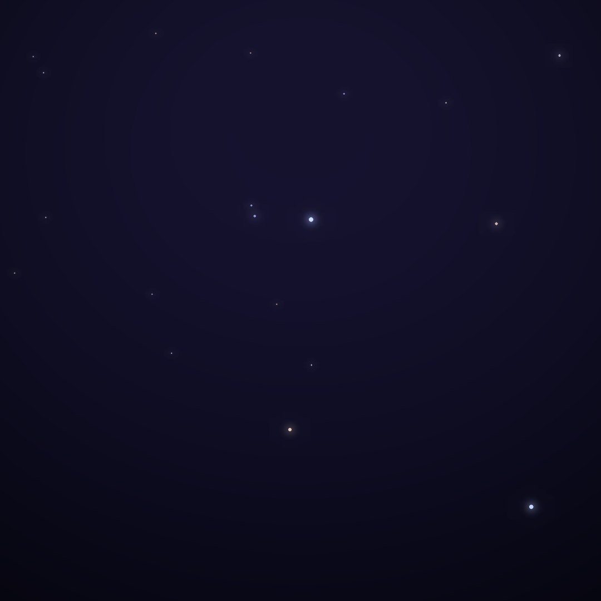
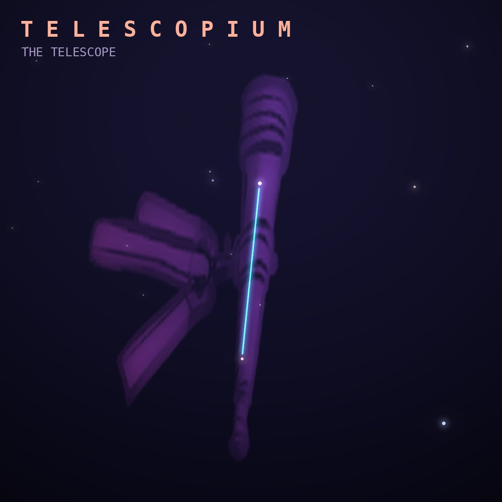

## Front

Which constellation is this?

## Back
# Telescopium
*The Telescope* · Tel · genitive *Telescopii*

One of Lacaille's 1750s instrument constellations, honoring the telescope. It is a faint patch south of Sagittarius.

- **Brightest star:** α Telescopii, magnitude 3.5
- **Best seen:** August evenings
- **Fully visible:** between 35°N and 90°S

> **Fun fact:** Lacaille's telescope originally stretched into Sagittarius, Scorpius and Ophiuchus. Later astronomers handed those stars back, shrinking it to the dim remnant we have today.
