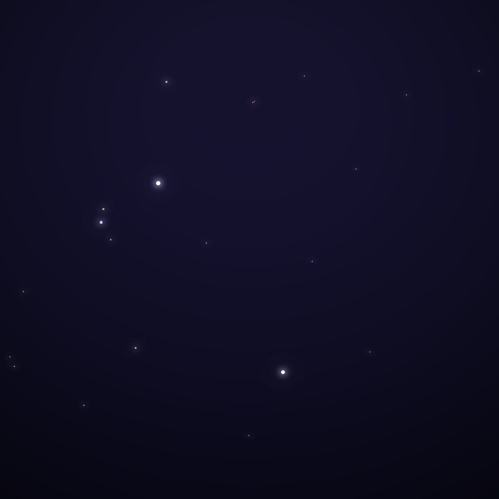
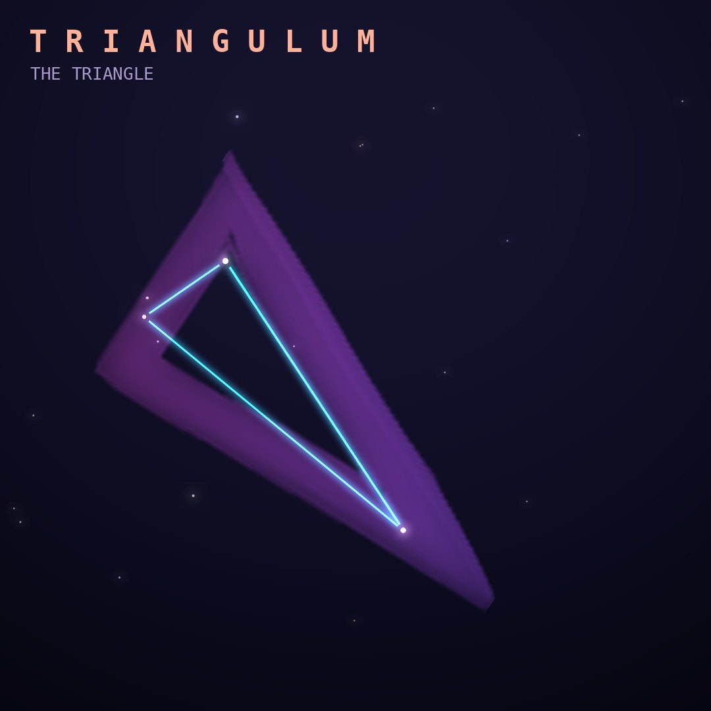

## Front

Which constellation is this?

## Back
# Triangulum
*The Triangle* · Tri · genitive *Trianguli*

A small triangle of stars between Andromeda and Aries, one of Ptolemy's 48 constellations. The Greeks saw it as the Nile Delta or the island of Sicily.

- **Brightest star:** Mizan (β Trianguli), magnitude 3.0
- **Best seen:** December evenings
- **Fully visible:** between 90°N and 55°S

> **Fun fact:** The Triangulum Galaxy (M33), about 3 million light-years away, is one of the most distant things the naked eye can see under very dark skies.
