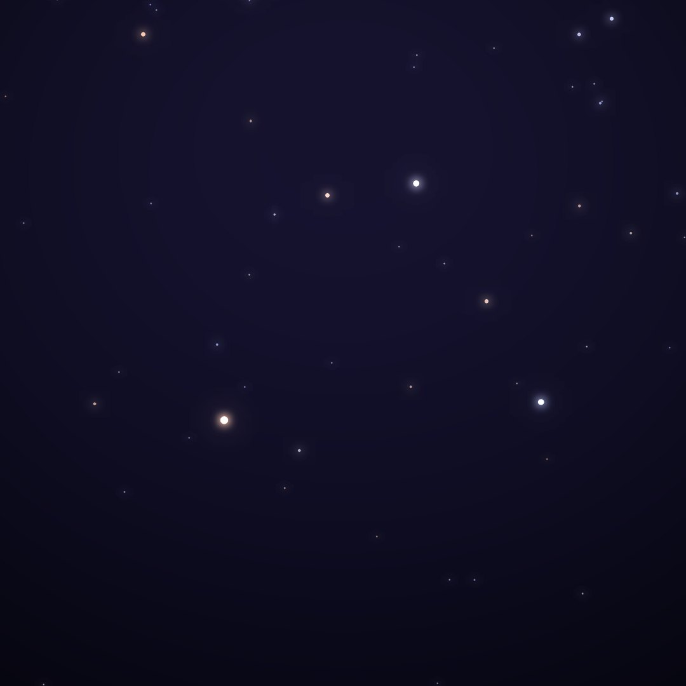
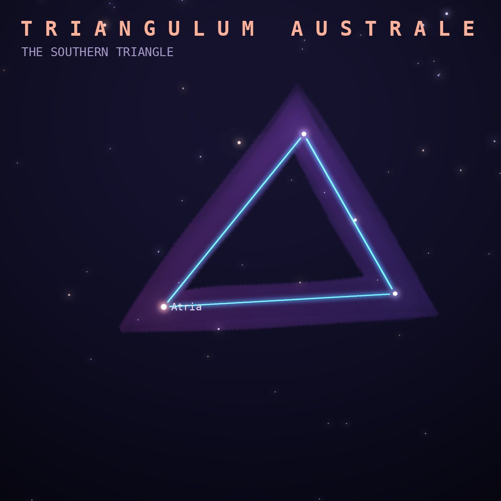

## Front

Which constellation is this?

## Back
# Triangulum Australe
*The Southern Triangle* · TrA · genitive *Trianguli Australis*

A bright, compact triangle in the southern Milky Way near Alpha Centauri, introduced by Keyser and de Houtman in the 1590s.

- **Brightest star:** Atria (α Trianguli Australis), magnitude 1.9
- **Best seen:** July evenings
- **Fully visible:** between 20°N and 90°S

> **Fun fact:** It outshines its northern namesake: all three corner stars are brighter than magnitude 3, while Triangulum's brightest star is only magnitude 3.0.
