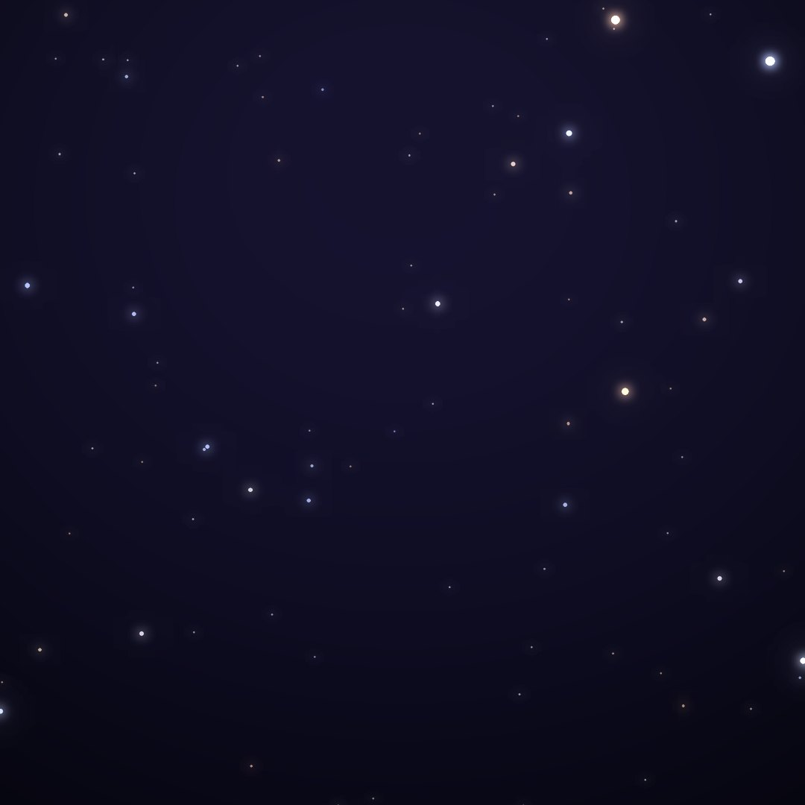
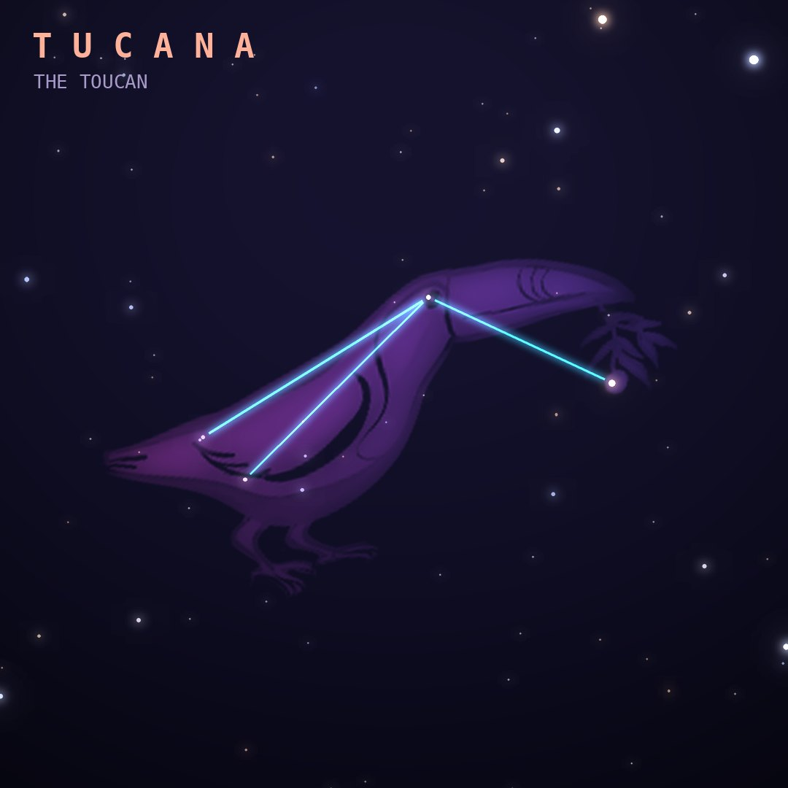

## Front

Which constellation is this?

## Back
# Tucana
*The Toucan* · Tuc · genitive *Tucanae*

A toucan, introduced by Keyser and de Houtman in the 1590s, holding the Small Magellanic Cloud in its region of sky.

- **Brightest star:** α Tucanae, magnitude 2.9
- **Best seen:** October evenings
- **Fully visible:** between 20°N and 90°S

> **Fun fact:** 47 Tucanae is so bright a globular cluster, with millions of stars, that it was first catalogued as a star and still carries a star-style designation.
