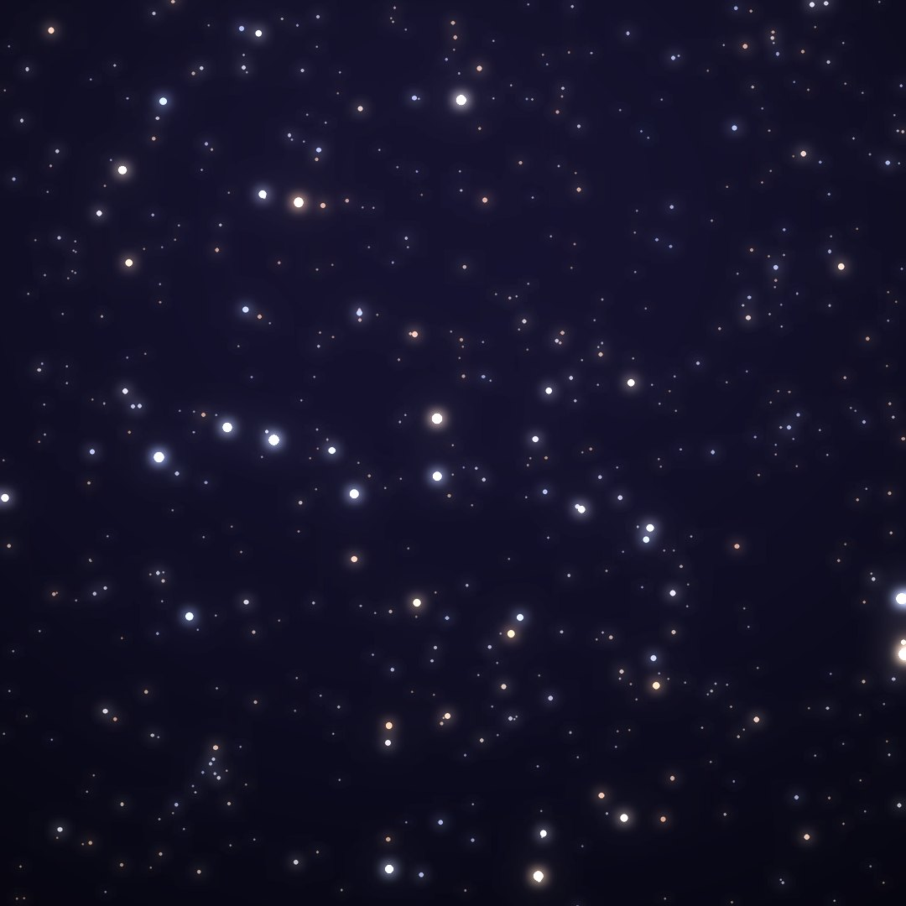
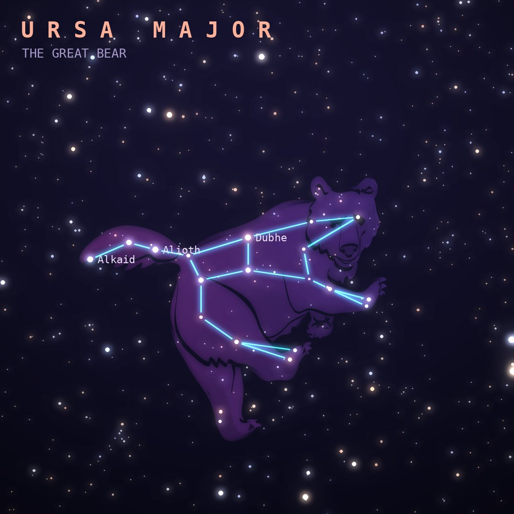

## Front

Which constellation is this?

## Back
# Ursa Major
*The Great Bear* · UMa · genitive *Ursae Majoris*

The nymph Callisto, turned into a bear. Its seven brightest stars form the Big Dipper, or Plough, and the two stars at the end of the bowl point to Polaris.

- **Brightest star:** Alioth (ε Ursae Majoris), magnitude 1.8
- **Best seen:** April evenings
- **Fully visible:** between 90°N and 20°S

> **Fun fact:** Mizar and Alcor in the Dipper's handle were a traditional eyesight test. Mizar was also the first double star seen through a telescope, around 1617.
