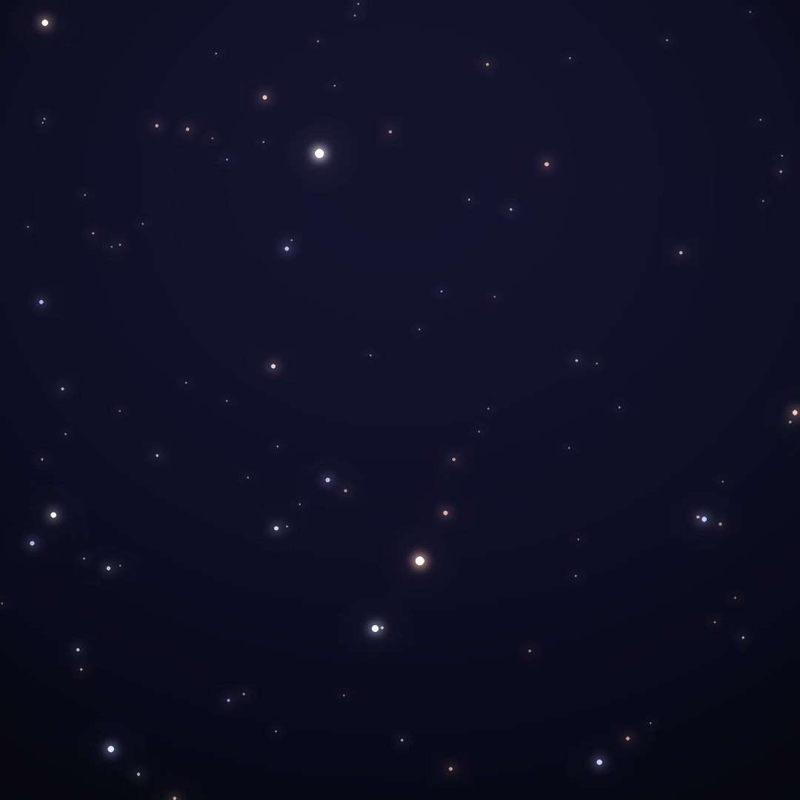
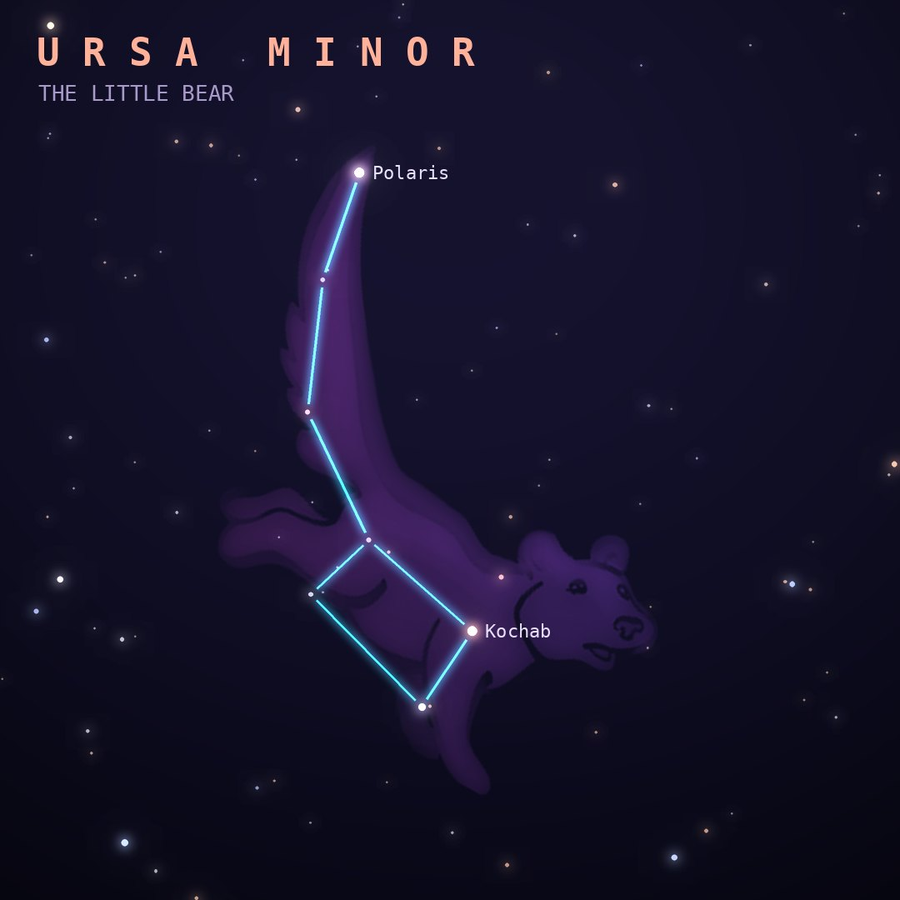

## Front

Which constellation is this?

## Back
# Ursa Minor
*The Little Bear* · UMi · genitive *Ursae Minoris*

The Little Dipper, with Polaris, the North Star, at the tip of its handle less than a degree from the north celestial pole.

- **Brightest star:** Polaris (α Ursae Minoris), magnitude 2.0
- **Best seen:** July evenings
- **Fully visible:** between 90°N and 0°

> **Fun fact:** Polaris won't always be the North Star. Earth's wobble brings it closest to the pole around 2100, then Errai in Cepheus takes over around AD 4000 and Vega around AD 14,000.
