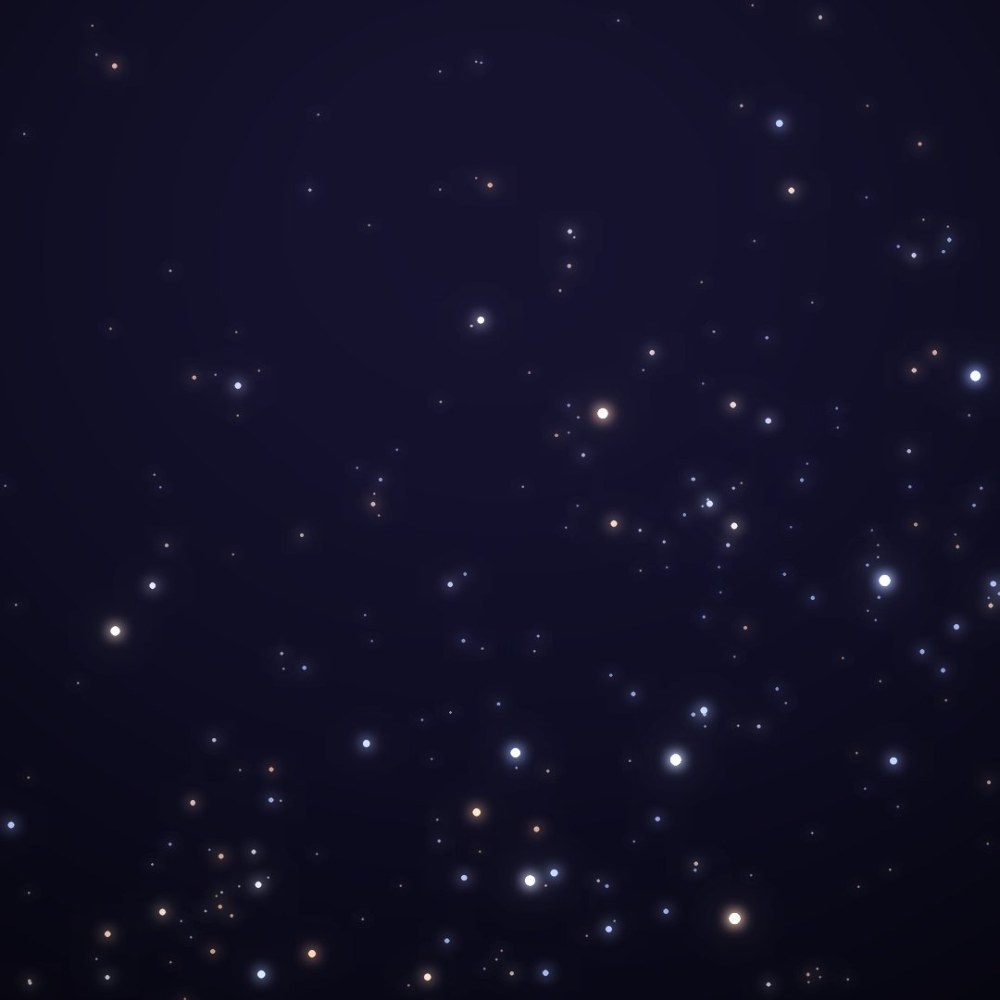
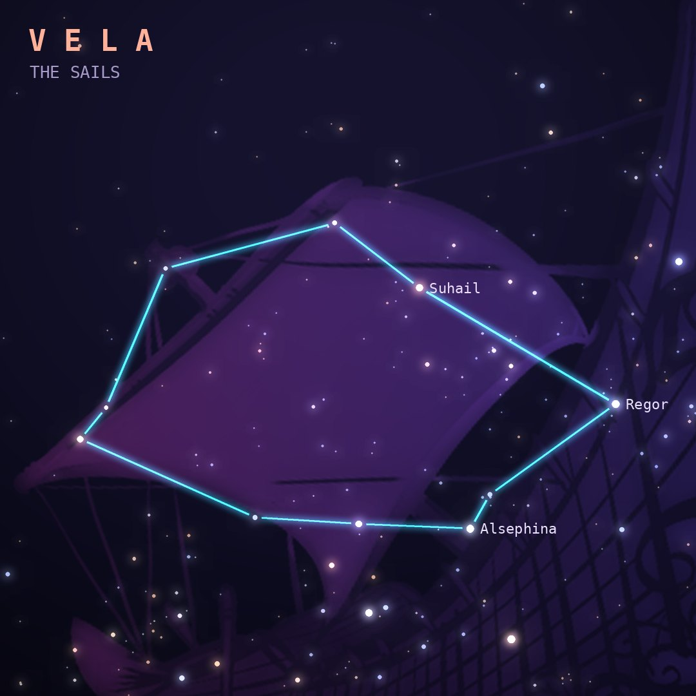

## Front

Which constellation is this?

## Back
# Vela
*The Sails* · Vel · genitive *Velorum*

The sails of Jason's ship Argo Navis, which Lacaille split into Carina, Puppis and Vela. Two of its stars help form the "False Cross", often mistaken for the Southern Cross.

- **Brightest star:** Regor (γ2 Velorum), magnitude 1.8
- **Best seen:** March evenings
- **Fully visible:** between 35°N and 90°S

> **Fun fact:** The Vela Pulsar, left by a supernova about 11,000 years ago, spins about 11 times every second and sits inside a huge glowing shell of supernova debris.
