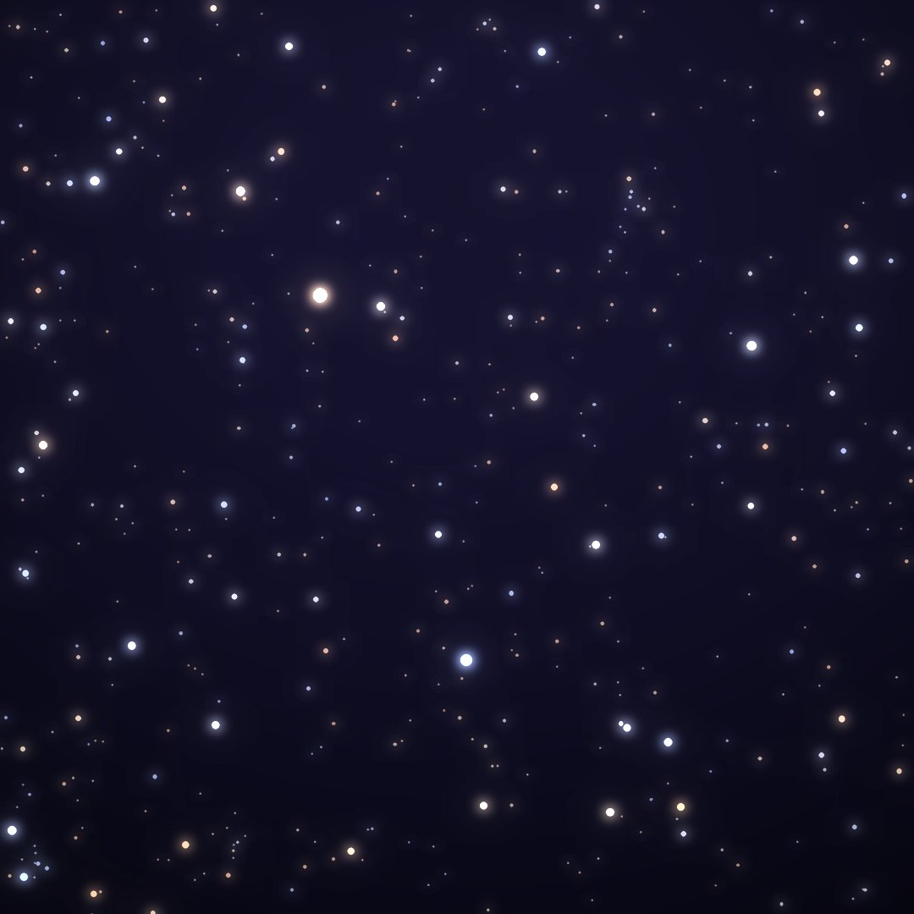
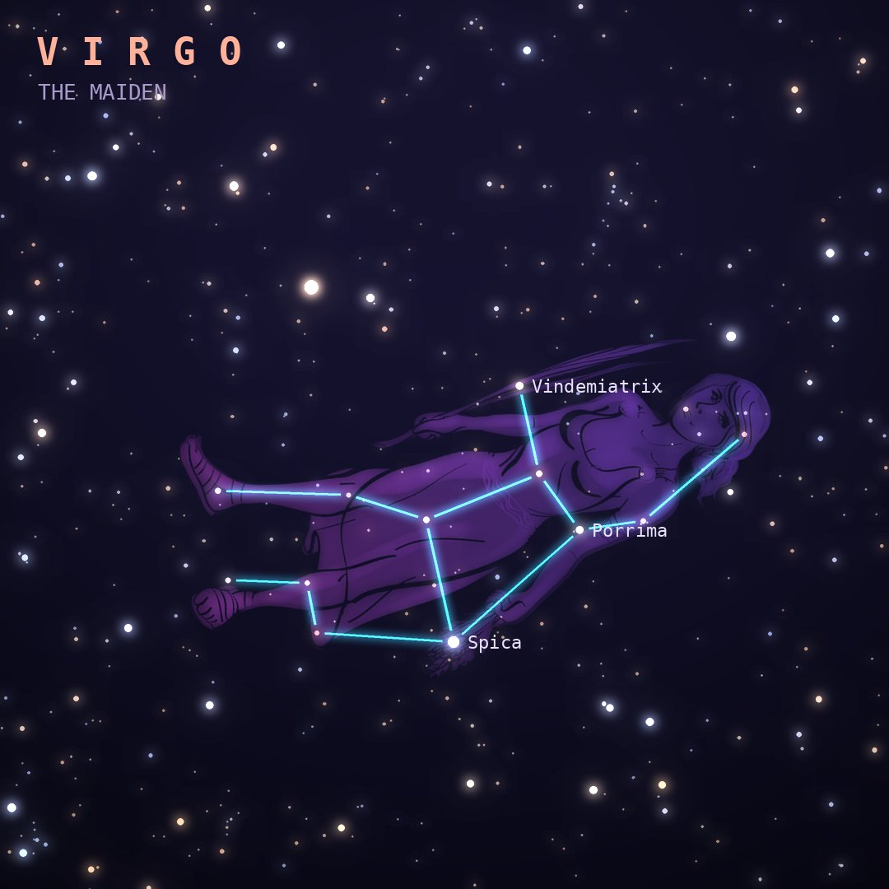

## Front

Which constellation is this?

## Back
# Virgo
*The Maiden* · Vir · genitive *Virginis*

The second-largest constellation and the largest in the zodiac: a maiden holding an ear of wheat, marked by the bright star Spica, often identified with Demeter or Astraea.

- **Brightest star:** Spica (α Virginis), magnitude 1.0
- **Best seen:** May evenings
- **Fully visible:** between 70°N and 75°S

> **Fun fact:** It points toward the Virgo Cluster of over a thousand galaxies, including M87, whose central black hole was the first ever photographed, in 2019.
