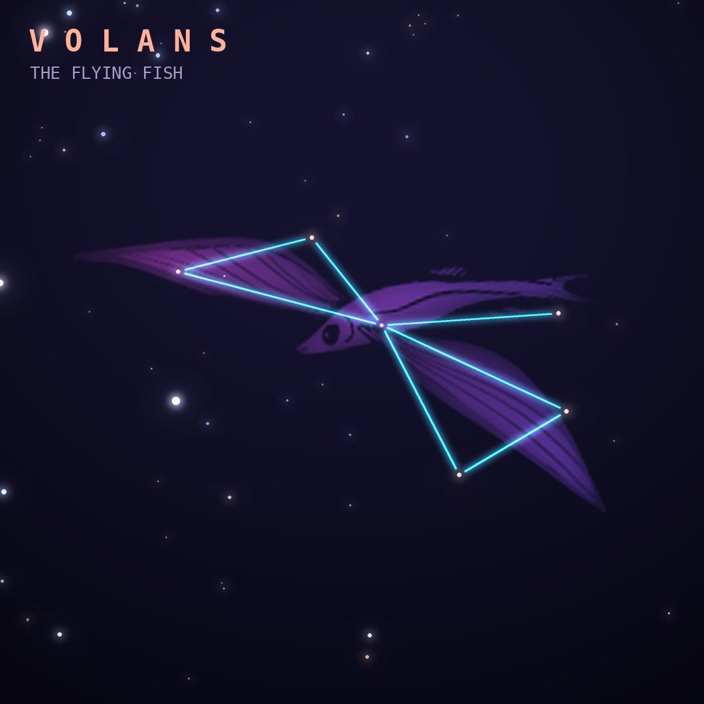

## Front

Which constellation is this?

## Back
# Volans
*The Flying Fish* · Vol · genitive *Volantis*

A flying fish, introduced by Keyser and de Houtman in the 1590s after sailors saw the fish gliding over tropical seas.

- **Brightest star:** β Volantis, magnitude 3.8
- **Best seen:** March evenings
- **Fully visible:** between 15°N and 90°S

> **Fun fact:** Old star atlases show Volans fleeing the jaws of Dorado, the dolphinfish next door, just as real dolphinfish hunt flying fish.
