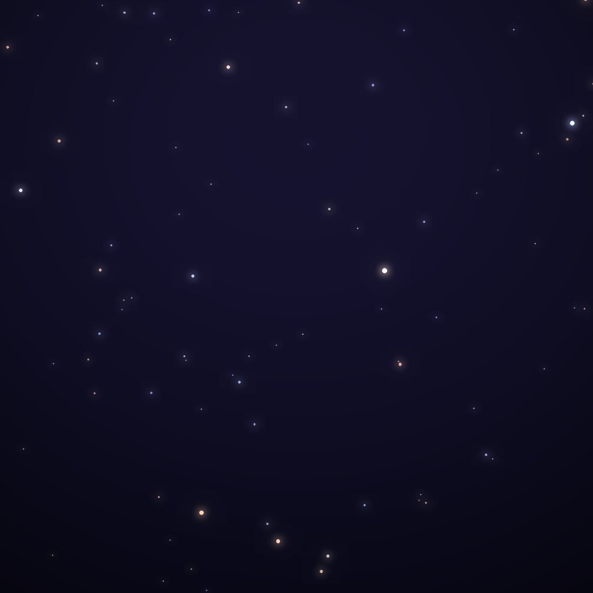
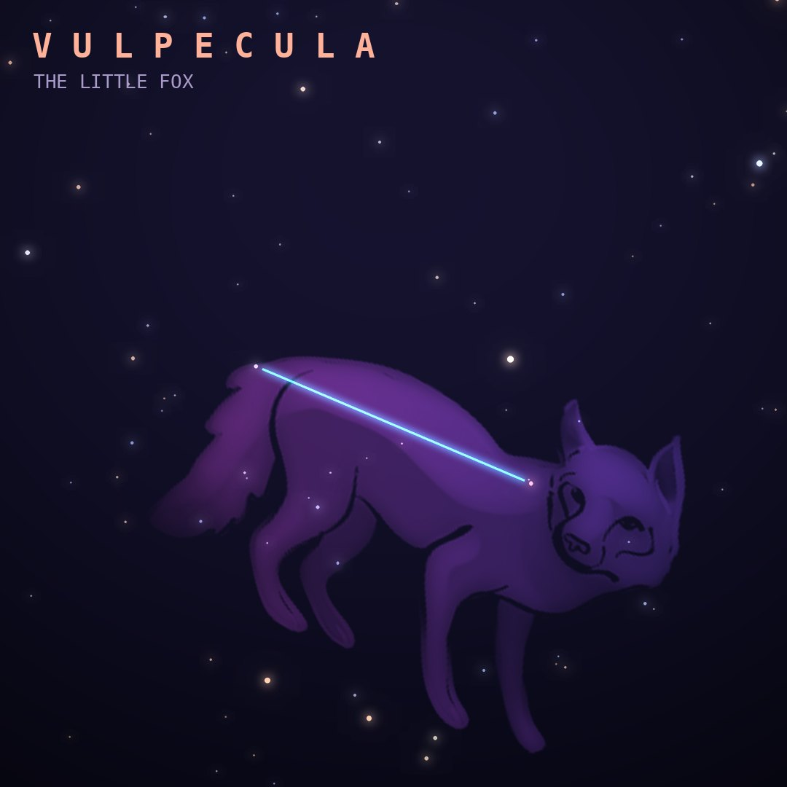

## Front

Which constellation is this?

## Back
# Vulpecula
*The Little Fox* · Vul · genitive *Vulpeculae*

Created by Johannes Hevelius in 1687 as Vulpecula cum Ansere, the little fox with a goose in its jaws. It lies in the Milky Way just south of Cygnus.

- **Brightest star:** Anser (α Vulpeculae), magnitude 4.4
- **Best seen:** August evenings
- **Fully visible:** between 90°N and 60°S

> **Fun fact:** The first pulsar ever found, discovered by Jocelyn Bell Burnell in 1967, is in Vulpecula; its regular pulses earned it the joke nickname LGM-1, for "Little Green Men".
